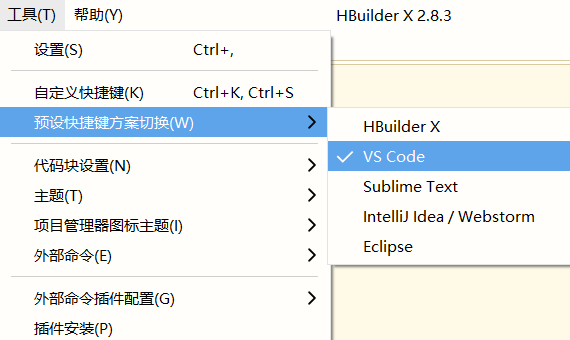
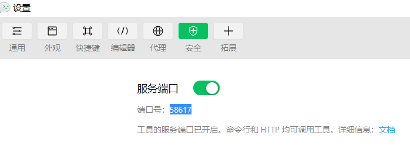
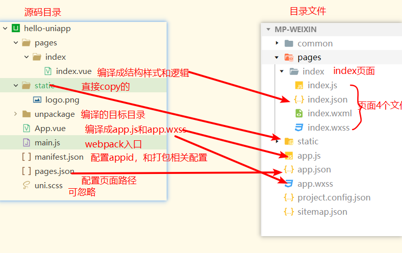
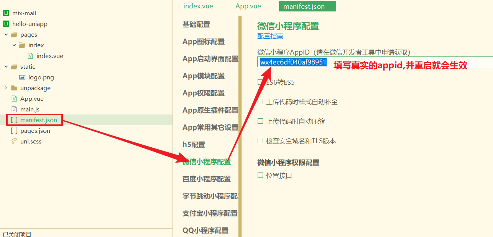

## day03

### 复习

ES6中的模块化

练习：

+ 克鲁塞德战记
  + 首页
  + 详情页面
+ lol
  + 列表页面
  + 详情页面
  + 项目
    + 发布
    + 上线

语法：

+ wx:key="*this"
+ 编程式导航： wx.navigatorTo()
+ 事件参数： 
  + 传参： `<view bindtap="abc" data-参数名="参数值"></view>`
  + 接收参数： `abc(event){ event.currentTarget.dataset.参数名 }`
+ target 与 currentTarget 的区别：
  + currentTarget  绑定事件的 dom 元素
  + target  触发事件的 dom 元素
+ 开发工具的：编译模式

组件：

+ 轮播图
+ navigator


### 今日内容

准备工作：

+ 项目介绍
+ 小程序开发的项目的对比
+ 工具：
  + Dcould（公司）
  + HBuild + uni-app

项目


### 优购 - 项目介绍

> 黑马优购是一个小程序端的电商网站

+ 商城的业务类型
  + 传送门](https://market.cloud.tencent.com/pindao/program)

+ 小程序最常见的业务类型就是商城

+ 优购商城的基本逻辑
  + 基本逻辑会参考京东App和小米lite小程序
  + 基本逻辑，分类找一个分类名，搜索，搜索列表，点一个商品，商品详情，加入购物车，购物车，支付，订单结果页
+ 项目支持多端
  + uni-app：一套代码支持所有前端应用
  + 小程序，h5, app

+ 接口
  + [传送门](https://www.showdoc.cc/696455032746099?page_id=3984516634822174)


### 优购 - 资料目录说明


### 框架 - 小程序几大框架对比

> 回顾： vue
>
> > 技术选型：
> >
> > > 技术 vue
> > >
> > > 第三方组件库：
> > >
> > > > element-ui（PC）
> > > >
> > > > vant（移动）

#### **MINA**

> 原生的小程序框架，官方框架

+ 语法：
  + 语法怪，类 vue 的

+ 开发工具
  + 微信开发者工具
+ 特点
  + 提示不够
  + 对第三方组件支持得不好
  + npm 支持也不太好

#### **wepy**

> 可以用 vue 语法来写小程序的代码

+ 语法：
  
+ 类 vue
  
+ 开发工具：
  
  + vscode
+ 特点：
  
  + bug 多，业内口碑差
+ 作者：
  
  + tencent
  
  

#### **mpvue**

> 可以用 vue 语法来写小程序的代码

+ 语法：
  + 类 vue
+ 开发工具：
  + vscode

+ 特点：
  + 基本上支持所有的小程序（支付宝小程序，抖音小程序，头条小程序，百度小程序）
  + 一套代码写完后，可以发布为微信小程序，支付宝小程序
  + 坑挺多
  + 基本上3年没有人维护
+ 作者
  + 美团

#### **uni-app**（重点）

> 可以用 vue 语法来写小程序的代码

+ 语法：
  + vue语法

+ 开发工具：
  + Hbuild
+ 特点：
  + 一套代码支持所有的小程序，还有h5，还有app
  + 坑比较少
  + 社区活跃度比较高，文档很详细
+ 作者：
  + 数字天堂（Dcould）

#### **Taro**

+ 语法
  + 支持 React 语法
  + 支持 Vue 语法

**扩展：**

+ 什么是跨端开发框架？
  + 跨端开发框架，一套代码支持多端
  + 多端：小程序 、h5、APP
  
+ 小程序第三方框架对比（装逼神器）：
  + [传送门](https://juejin.im/post/5ca1736af265da30ae314248)


### Dcould - 产品简介

[传送门](https://www.dcloud.io/)

+ **HBuilderX** 
  + 写代码工具：类似于 vscode
  + 不是国产的IDE，由IBM eclipse+插件组装起来

+ **uni-app**
  + 框架
  + 写vue.js代码，编译成多个平台应用

+ **h5+**
  + h5+js访问原生App(打开相机，振动，打电话。。)的能力


+ **MUI**
  + h5+基础上的一套ui库

> 文档相当详细。仔细阅读可以把前端的知识给补齐


### HBuilder - 安装

> 软件版本名称：
>
> > Alpha：内测版
> >
> > Bate：公测版
> >
> > 正式版

[传送门](https://www.dcloud.io/hbuilderx.html)

**安装：**

+ 下载哪个版本？

  + 装App版本的

+ 解压安装
  + 在c盘新建一个myApp的目录
  + 把hbuilder.zip拖进去，解压完成（一定要全部解压完成）
  + 右键 - 固定到“开始”屏幕
  + 点击"HBuilderX.exe"运行即可
+ 打开过程中，会提示选择主题和快捷键，可以忽略
  
+ 需要注册？
  + 尽量注册
  + 注册之后还需要进行激活（提示信息）
  + 但是不用认证
  
  


### HBuilder - 练习

+ 工具->主题，选择你喜欢的主题


+ 设置快捷键： 工具-> 预设快捷键方案切换，选择vs code



+ 新建项目
  + 左侧右键，新建-项目
+ 工具->设置


+ 显示左侧视图
  + 鼠标到最左侧，向右拉
  + 双击顶部文件名

+ 关闭项目
  + 选中项目，右键关闭项目即可

+ 支持vue.js语法


### uniapp - 基本使用

> [传送门](https://uniapp.dcloud.io/)

+ 概念
  + `uni-app` 是一个使用 [Vue.js](https://vuejs.org/) 开发所有前端应用的框架 

+ 新建项目


+ 运行
  + 运行到浏览器
    + 先打开pages 某一个页面，然后运行->运行到内置浏览器（或者运行到浏览器->chrome）
  + 打包成apk
    + 发行->原生App云打包，弹框
    + 去勾选iOS，需要个人搞一个证书


+ 可以查看打包状态，如果打包成功的话，会返回一个链接
  + 发行->原生App-查看云打包状态
  + 通过这个链接下载apk，安装

**注意点：**

+ 内置浏览器需要装插件

+ 提示安装scss插件
  + 工具->插件安装，大概是去到插件市场，找到安装
  + 这里如果要安装需要注册一个帐号，并且帐号需要激活


+ hbuilder里面插件安装，也是装一个npm包，它可以保证装npm包和其他npm包是兼容的

+ 打包APK需要账号认证


### uniapp-运行到微信开发者工具

+ 选择项目->运行。。。 运行到微信开发者工具


+ 配置微信开发者工具路径
  + 初次运行时，弹框选择微信开发者工具安装的路径，一般是：`C:/Program Files (x86)/Tencent/微信web开发者工具`

+ 微信开发者工具，打开服务器端口。打开工具 -> 设置 -> 安全设置，将服务端口开启




+ uniapp项目运行到不用平台的时，都会在底部终端打开窗口


+ 运行到不同平台时，会根据源码生成目标文件，都在unpackage目录下


### uniapp - 文档简介

+ 介绍
  + [传送门](https://uniapp.dcloud.io/)

+ 框架
  + 框架原因，基本上内容和微信开放文档的内容差不多
+ 除了可以用小程序的相关内容之外， vue 中的内容也可以直接使用
  
+ 组件
  + 基本组件和微信小程序组件名字完全一致
  + 当需要某结构时，引入组件

+ API
  + 就是js方法
+ 插件市场
  + npm包，less,sass
  + 开源项目，可以引入，hbuilder新建项目，运行起来


### uniapp - 工程结构

[传送门](https://uniapp.dcloud.io/frame?id=%e7%9b%ae%e5%bd%95%e7%bb%93%e6%9e%84)



+ 页面都存放在`pages/页面名/文件名.vue`
  
+ 包括页面的结构，逻辑和样式
  
+ App.vue是主组件，会编译成app.js和app.wxss

  +存放公共的样式和逻辑

+ main.js webpack入口

+ manifest.json配置小程序id和打包相关



+ pages.json，会转成app.json

  ```json
  {
  	"pages": [ //pages数组中第一项表示应用启动页，参考：https://uniapp.dcloud.io/collocation/pages
  		{
              //页面路径
  			"path": "pages/index/index",
              //页面配置
  			"style": {
                  //配置属性名完全和小程序一致
  				"navigationBarTitleText": "uni-app"
  			}
  		}
  	],
      //相当于app.json window属性
  	"globalStyle": {
          //属性名和小程序完全一致
  		"navigationBarTextStyle": "black",
  		"navigationBarTitleText": "uni-app",
  		"navigationBarBackgroundColor": "#F8F8F8",
  		"backgroundColor": "#F8F8F8"
  	}
  }
  ```

**注意点**

+ 整个uniapp的项目结构和vue-cli生成的项目结构是差不多的。内部也是有webpack的。


### uniapp - 语法

>  uniapp 完全可以使用Vue.js语法，可以使用小程序组件和API，不能使用html标签
>
> [传送门](https://uniapp.dcloud.io/frame)

+ 组件
  + view,text,navigator,image,button,swiper,picker

  + 不应该使用组件ul,li,img
+ vue语法
  + v-model, v-for, v-if，v-bind
+ 事件注册
+ 方法中this
+ 样式
  + 完全一样
+ api
  + 方法名完全一致,把wx.换成uni.

**注意点**

+ 非uniapp组件不要使用, image和swiper组件是固定宽度
+ image 默认的宽度为： 320
  + 如果使用需要手动设置
+ input 默认没有了边框：
  + 使用时可以手动添加


### 优购 - 项目准备

+ 创建项目`uni-yougou59`
  + 选择默认模板


+ 推送项目到码云
  + 在码云上新建仓库`uni-yougou56`

  + 填写名字，设置公开即可

+ 推送本地项目到远端
  + 结合vscode操作更好

    ```bash
    #去本地项目下
    git init #初始化本地仓库
    git add . #添加当前目录下所有的文件到暂存区
    git commit -m 'xxx' #提交
    git remote 你的远端仓库地址 #添加远端服务器地址
    git push -u origin master #在远端仓库并推送本地master分支到远端
    ```

+ 创建分支并推送到远端，分支名`feature/20200829`

  ```bash
  git checkout -b feature/20200829 #基于当前分支创建分支
  git push --set-upstream origin feature/20200829 #在远端仓库创建分支，并推送本地分支
  ```


### 小程序 - Tab栏基本使用

[传送门](https://developers.weixin.qq.com/miniprogram/dev/reference/configuration/app.html#tabBar)

**作用**

+ 一般是作为底部一组菜单，点某个菜单，显示对应的页面

**用法**

+ **只能配置最少 2 个、最多 5 个 tab** 

+ app.json配置就行

+ 具体的配置

  + color和selectedColor是公共属性，所以和list是平级的

    ```json
    //tabBar配置在app.json里面，和window平级  
    "tabBar": {
        //未选中时文字的颜色
        "color": "#ff0000",
        //选中时文字的颜色
        "selectedColor": "#0000ff",
        "list": [
          {
             //点击text显示pathPath对应的页面
            "pagePath": "pages/index/index",
            "text": "首页",
             "iconPath" //未选中时的图标
             "selectedIconPath" //选中时的图标
          },
          {
            "pagePath": "pages/logs/logs",
            "text": "日志"
          }
        ]
      },
    ```

    

**注意点：**

+ 小程序里面也有tabbar组件，只不过配置就行。

+ uniapp里面tabbar配置放在pages.json里面，和globalStyle平级。属性名和小程序完全一致


### 优购 - tarBar设置


**步骤**

+ copy `learnmp\优购\图片资源`到项目的static目录

+ 新建4个页面，home,category, cart,me，并在pages.json添加路径

+ tabbars配置copy过来，先保证首页和分类切换

+ 首页和分类，图标加上

+ 再完善购物车，和我的

**注意点：**

+ 不要想着配置一次搞定，先完成两个tab

+ tabBar配置图标的路径只能是本地图片，本地快呀。

+ tabBar配置图标最好是绝对路径

+ 虽然uniapp支持运行到多个平台，但是先保证微信开发者工具里面运行OK，因为微信开发者工具里面方便调试

+ 静态资源放在static,不要新建images目录

+ 查看错误信息
  + 先看hbuilder错误信息，再看微信开发者工具，调试器console的错误信息


### 小程序 - 自适应单位rpx 

[传送门](https://developers.weixin.qq.com/miniprogram/dev/framework/view/wxss.html#%E5%B0%BA%E5%AF%B8%E5%8D%95%E4%BD%8D)

##### 什么是自适应(响应式)？

页面在不同尺寸的设备上显示良好

> 响应式基本上和自适应一个意思

+ 最早的时候是用： @media 来实现自适应


##### 黑马面面能否自适应？

1. 可以

 	2. flexible.js+rem(TODO)

+ 总结：
  + 之前如果要实现自适应：
    + 自己写 @meida
    + 使用第三方包来解决


##### rpx单位的概念？

1. 小程序的自适应直接使用rpx单位
2. px单位不能自适应，但是rpx会随着屏幕大小变化
3.  规定所有屏幕宽为750rpx，**所有设备屏幕宽750等分，每一份1rpx**


##### rpx单位如何使用呢？

1.  官方说的：开发微信小程序时设计师可以用 iPhone6 作为视觉稿的标准 
2. 也就是说，设计稿是iphone6的2倍图，意思就是设计稿的尺寸是750px
3. **代码里面写的rpx值=设计稿量的值**


**使用场景**

+ 什么时候使用px单位，什么时候使用rpx单位
  + margin,width,height,padding都应该使用rpx单位
  + 大多数时候，font-size建议大家用px

