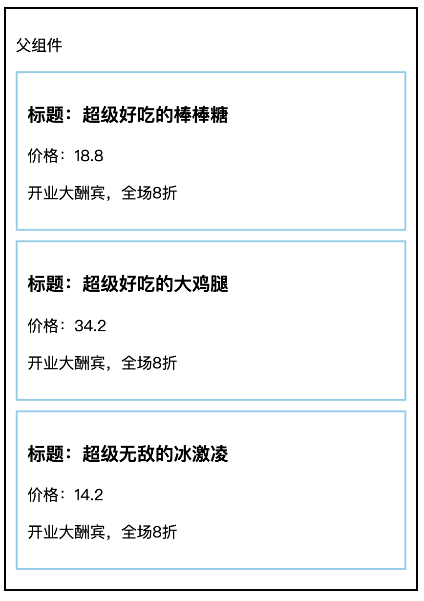
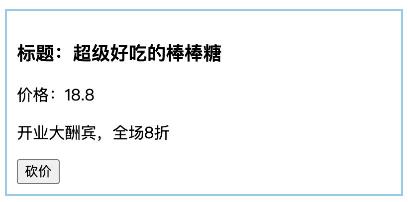
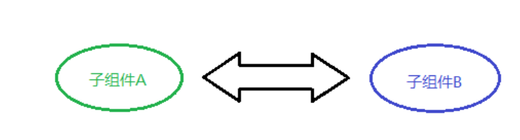

# 组件通讯

+ [ ] 组件通讯介绍以及为什么要有组件通讯
+ [ ] 组件的props
+ [ ] 组件通讯的三种方式 父传子  子传父  兄弟组件
+ [ ] Context组件通讯

## 组件通讯介绍

**目标**：了解为什么需要组件通讯？

**内容：**

+ *组件*是独立且封闭的单元，默认情况下，只能使用组件自己的数据。
+ 在组件化过程中，我们将一个完整的功能拆分成多个组件，以更好的完成整个应用的功能。
+ 而在这个过程中，多个组件之间不可避免的要共享某些数据
+ 为了实现这些功能，就需要`打破组件的独立封闭性`，让其与外界沟通。这个过程就是**组件通讯**。

**总结**

1. *组件中的状态是私有的*，也就是说，组件的状态只能在组件内部使用，无法直接在组件外使用

## props基本使用

**目标：**掌握props的使用语法

**内容：**

- property 属性的简写
- 使用场景：组件接收外部数据时
- 作用：接收（其他组件）传递给当前组件的数据
- 如何传递？给组件标签添加属性，就表示给组件传递数据
- 如何接收？函数组件通过参数 `props` 接收数据，类组件通过 `this.props` 

**核心代码：**

+ 函数组件获取props

```js
// 接收数据：
// props 的值就是：{ name: 'jack', age: 19 }
function Hello(props) {
  return (
    <div>接收到数据:{props.name}</div>
  )
}

// 传递数据：
// 可以把传递数据理解为调用函数 Hello，即：Hello({ name: 'jack', age: 19 })
<Hello name="jack" age={19} />
```
+ 类组件获取props

```js
// 接收数据：
// class 组件需要通过 this.props 来获取
class Hello extends Component {
  render() {
    return (
      <div>接收到的数据:{this.props.age}</div>
    ) 
  }
}

// 传递数据：
<Hello name='jack' age={19} />
```

**总结：**

+ props是实现组件通讯的关键，在实现组件通讯之前，需要先掌握props的基本语法

## props的注意点

**目标：** 了解props的特点，知道什么是单向数据流

**内容：**

+ **props 是只读对象**，只能读取对象中的属性，无法修改
  + `单向数据流`，也叫做：自上而下的数据流
  + 表示：父组件中的数据可以通过 props 传递给子组件，并且，当父组件中的数据更新时，子组件就会自动接收到最新的数据
  + 父组件的数据更新会流动到子组件，不能反过来，子组件直接去修改父组件的数据
  + 类比：就像瀑布的水一样只能从上往下流动，并且，当上游的水变浑浊，下游的水也会受到影响
+ 可以传递任意数据（数字  字符串  布尔类型 数组 对象 函数 jsx）

## 组件通讯-父传子

**目标**：将父组件的数据，传递给子组件

**内容**：

+ 父组件提供要传递的state数据
+ 给子组件标签添加属性，值为 state 中的数据
+ 子组件中通过 props 接收父组件中传递的数据

**核心代码**

父组件提供数据并且传递给子组件

```js
class Parent extends React.Component {
    state = { lastName: '王' }
    render() {
        return (
            <div>
                传递数据给子组件：<Child name={this.state.lastName} />
            </div>
        )
    }
}
```

子组件接收数据

```js
function Child(props) {
	return <div>子组件接收到数据：{props.name}</div>
}
```

## 组件通讯-父传子练习

**目标：**



**核心代码**

+ 数据

```js
// 列表数据
[
  { id: 1, name: '超级好吃的棒棒糖', price: 18.8, info: '开业大酬宾，全场8折' },
  { id: 2, name: '超级好吃的大鸡腿', price: 34.2, info: '开业大酬宾，全场8折' },
  { id: 3, name: '超级无敌的冰激凌', price: 14.2, info: '开业大酬宾，全场8折' }
]
```
+ 样式

```css
/* 基础样式 */
.parent {
  width: 400px;
  padding: 10px;
  border: 2px solid black;
}
.child {
  margin: 10px 0;
  padding: 10px;
  border: 2px solid skyblue;
}
.money {
  color: red;
}

.product {
  width: 400px;
  padding: 20px;
  border: 2px solid #000;
  border-radius: 5px;
  margin: 10px;
}
```

## 组件通讯-子传父

**目标：**能够将子组件的数据传递给父组件

**内容**：

思路：利用回调函数，父组件提供回调，子组件调用，将要传递的数据作为回调函数的参数。
1. 父组件提供一个回调函数（用于接收数据）（箭头函数）
2. 将该函数作为属性的值，传递给子组件
3. 子组件通过 props 调用回调函数
4. 将子组件的数据作为参数传递给回调函数

**核心代码**：

父组件提供函数并且传递给子组件

```js
class Parent extends React.Component {
    getChildMsg = (msg) => {
        console.log('接收到子组件数据', msg)
    }
    render() {
        return (
            <div>
            	子组件：<Child getMsg={this.getChildMsg} />
            </div>
        )
    }
}
```

子组件接收函数并且调用

```js
class Child extends React.Component {
    state = { childMsg: 'React' }
    handleClick = () => {
    	this.props.getMsg(this.state.childMsg)
    }
    return (
    	<button onClick={this.handleClick}>点我，给父组件传递数据</button>
    )
}
```

**总结**：

 + 无论是父传子还是子传父，其实都是依赖于props实现的

## 组件通讯-子传父练习

**目标：**



## 组件通讯-兄弟组件

**目标：**能够理解什么是状态提升，并实现兄弟组件之间的组件通讯

**内容**：

+ 将共享状态提升到最近的公共父组件中，由公共父组件管理这个状态
+ 思想：**状态提升**
+ 公共父组件职责：
  + 提供共享状态 
  + 提供操作共享状态的方法
+ 要通讯的子组件只需通过 props 接收状态或操作状态的方法

状态提升前



状态提升之后


**核心代码**

+ `index.js`

```jsx
import React, { Component } from 'react'
import ReactDOM from 'react-dom'
import Jack from './Jack'
import Rose from './Rose'
class App extends Component {
  // 1. 状态提升到父组件
  state = {
    msg: '',
  }
  render() {
    return (
      <div>
        <h1>我是App组件</h1>
        <Jack say={this.changeMsg}></Jack>
        {/* 2. 把状态给子组件显示 */}
        <Rose msg={this.state.msg}></Rose>
      </div>
    )
  }
  changeMsg = (msg) => {
    this.setState({
      msg,
    })
  }
}

// 渲染组件
ReactDOM.render(<App />, document.getElementById('root'))
```

+ `jack.js`

```jsx
import React, { Component } from 'react'

export default class Jack extends Component {
  render() {
    return (
      <div>
        <h3>我是Jack组件</h3>
        <button onClick={this.say}>说</button>
      </div>
    )
  }
  say = () => {
    this.props.say('you jump i look')
  }
}

```

+ `rose.js`

```jsx
import React, { Component } from 'react'

export default class Rose extends Component {
  render() {
    return (
      <div>
        <h3>我是Rose组件-{this.props.msg}</h3>
      </div>
    )
  }
}

```

## 组件通讯 - Context

**目标：**通过context实现跨级组件通讯

**内容**  

+ 组件之间的层级关系，除了以上两种常见的情况外，还有一种不太常见的情况，那就是：远房亲戚关系（也就是两个组件之间间隔较远） 

  
  

+ 实现方式：使用 Context 来实现跨组件传递数据

**核心代码**

```jsx
import { createContext } from 'react'

// 1 创建 Context 对象
const { Provider, Consumer } = createContext()

// 2 使用 Provider 组件包裹整个应用，并通过 value 属性提供要共享的数据
<Provider value="blue">
  <div className="App">
    <Child1 /> 
  </div>
</Provider>

// 3 使用 Consumer 组件接收要共享的数据
<Consumer>
  {data => <span>data参数表示接收到的数据 -- {data}</span>}
</Consumer>
```

## 综合案例：B站评论列表

### 组件拆分

**目标：**B站评论列表案例拆分成多个组件，让代码更容易维护

**思路：**

1. 拆分组件`Tabs.js`
2. 拆分组件`Form.js`
3. 拆分组件`List.js`

**核心代码：**


### tab栏切换功能

**目标：**完成tab栏切换功能

**步骤**

1. 渲染tab栏
2. 完成tab栏的切换功能

**核心代码**

```jsx
import { Component } from 'react'

class Tabs extends Component {
  render() {
    const { tabs, active, changeTab } = this.props
    return (
      <div className="tabs-order">
        <ul className="sort-container">
          {tabs.map((item) => (
            <li
              key={item.id}
              className={item.type === active ? 'on' : ''}
              onClick={() => changeTab(item.type)}
            >
              按{item.name}排序
            </li>
          ))}
        </ul>
      </div>
    )
  }
}

export default Tabs

```


```jsx
{/* 排序 */}
<Tabs tabs={tabs} active={active} changeTab={this.changeTab}></Tabs>
```


### 评论列表展示-父传子

**目标：**通过父传子的方式实现评论列表的展示

**步骤**

1. 父组件通过父传子的方式把list传递给子组件
2. 子组件渲染评论列表案例

**核心代码**

```jsx
import React from 'react'
import avatar from '../images/avatar.png'
export default class CommentList extends React.Component {
  render() {
    return (
      <div className="comment-list">
        {this.props.list.map((item) => (
          <div className="list-item">
            <div className="user-face">
              
            </div>
            <div className="comment">
              <div className="user">{item.author}</div>
              <p className="text">{item.comment}</p>
              <div className="info">
                <span className="time">{item.time.toString()}</span>
                <span
                  className={['like', item.attitude === 1 ? 'liked' : ''].join(
                    ' '
                  )}
                >
                  <i className="icon" />
                </span>
                <span
                  className={['hate', item.attitude === -1 ? 'hated' : ''].join(
                    ' '
                  )}
                >
                  <i className="icon" />
                </span>
                <span className="reply btn-hover">删除</span>
              </div>
            </div>
          </div>
        ))}
      </div>
    )
  }
}

```

### 删除评论-子传父

**目标：**通过子传父的方式，完成评论的删除功能

**步骤**

1. 父组件提供删除评论的方法
2. 父组件讲方法传递给子组件
3. 子组件注册点击事件，将id传递给父组件

**核心代码**

+ 给删除按钮注册点击事件

```jsx
<span
  className="reply btn-hover"
  onClick={() => this.del(item.id)}
>
  删除
</span>
```

+ 子传父

```jsx
del = (id) => {
  this.props.del(id)
}
```

+ 父组件提供方法

```jsx
{/* 评论列表 */}
<CommentList list={this.state.list} del={this.del}></CommentList>

del = (id) => {
  console.log(id)
  this.setState({
    list: this.state.list.filter((item) => item.id !== id),
  })
}
```

### 添加评论-子传父

**目标：**完成评论添加功能

**步骤：**

1. 子组件以受控组件的方式获取评论内容
2. 子组件通过子传父的方式将评论内容传递给父组件
3. 父组件接收到评论内容，并且添加评论内容

**核心代码**

+ 子组件核心代码

```jsx
import React from 'react'

export default class CommentAdd extends React.Component {
  state = {
    // ...
    content: '',
  }
  handleChange = (e) => {
    this.setState({
      content: e.target.value,
    })
  }
  add = () => {
    this.props.add(this.state.content)
    this.setState({
      content: '',
    })
  }
  render() {
    return (
      <div className="comment-send">
        <div className="user-face">
          
        </div>
        <div className="textarea-container">
          <textarea
            cols="80"
            rows="5"
            placeholder="发条友善的评论"
            className="ipt-txt"
            value={this.state.content}
            onChange={this.handleChange}
          />
          <button className="comment-submit" onClick={this.add}>
            发表评论
          </button>
        </div>
        <div className="comment-emoji">
          <i className="face"></i>
          <span className="text">表情</span>
        </div>
      </div>
    )
  }
}

```

+ 父组件核心代码

```jsx
{/* 添加评论 */}
<CommentAdd add={this.add}></CommentAdd>

add = (content) => {
  const newComment = {
    id: Date.now(),
    author: '作者',
    comment: content,
    time: new Date(),
    // 1: 点赞 0：无态度 -1:踩
    attitude: 0,
  }
  this.setState({
    list: [newComment, ...this.state.list],
  })
}
```


### 点赞与踩-子传父


