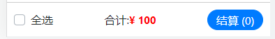

# React Hooks

- [ ] React Hooks 介绍 
- [ ] useState hook
- [ ] useEffect hook

## hooks是什么？

**目标**：能够说出react hooks是什么？

**内容**：

- `Hooks`：钩子、钓钩、钩住
- `Hooks` 是 **React v16.8** 中的新增功能 
- 作用：为**函数组件**提供状态、生命周期等原本 class 组件中提供的 React 功能
  - 可以理解为通过 Hooks 为函数组件钩入 class 组件的特性
- 注意：**Hooks 只能在函数组件中使用**，自此，函数组件成为 React 的新宠儿

React v16.8 版本前后，组件开发模式的对比：

- React v16.8 以前： class 组件(提供状态) + 函数组件(展示内容)
- React v16.8 及其以后：
  1. class 组件(提供状态) + 函数组件(展示内容)
  2. Hooks(提供状态) + 函数组件(展示内容)
  3. 混用以上两种方式：部分功能用 class 组件，部分功能用 Hooks+函数组件

**总结**

注意1：虽然有了 Hooks，但 React 官方并没有计划从 React 库中移除 class。

注意2：有了 Hooks 以后，不能再把**函数组件**称为无状态组件了，因为 Hooks 为函数组件提供了状态。

## 为什么要有 Hooks  

**目标**：能够说出为什么要有hooks，hooks能解决什么问题？

**内容**：

两个角度：1 组件的状态逻辑复用 2 class 组件自身的问题

1. 组件的状态逻辑复用：
   + 在 Hooks 之前，组件的状态逻辑复用经历了：mixins（混入）、HOCs（高阶组件）、render-props 等模式。
   + （早已废弃）mixins 的问题：1 数据来源不清晰 2 命名冲突。
   + HOCs、render-props 的问题：重构组件结构，导致组件形成 JSX 嵌套地狱问题。

2. class 组件自身的问题：
   + 选择：函数组件和 class 组件之间的区别以及使用哪种组件更合适
   + 需要理解 class 中的 this 是如何工作的
   + 相互关联且需要对照修改的代码被拆分到不同生命周期函数中
     + componentDidMount ->  window.addEventListener('resize', this.fn)
     + componentWillUnmount -> window.addEventListener('resize', this.fn)

- 相比于函数组件来说，不利于代码压缩和优化，也不利于 TS 的类型推导

**总结**

正是由于 React 原来存在的这些问题，才有了 Hooks 来解决这些问题

## hooks渐进策略

**目标**：能够理解在react中什么场景应该使用hooks

**内容**：

+ react没有计划从React中移除class [文档](https://zh-hans.reactjs.org/docs/hooks-intro.html)
+ Hook 和现有代码可以同时工作，你可以渐进式地使用他们。
  + 不推荐直接使用 Hooks 大规模重构现有组件 
  + 推荐：新功能用 Hooks，复杂功能实现不了的，也可以继续用 class
  + 找一个功能简单、非核心功能的组件开始使用 hooks
+ 之前的react语法并不是以后就不用了
  + class 组件相关的 API 在hooks中可以不用
    + state与setState
    + 钩子函数，`componentDidMount`、`componentDidUpdate`、`componentWillUnmount`
    + `this` 相关的用法
  + 原来学习的内容还是要用的
    + JSX：`{}`、`onClick={handleClick}`、条件渲染、列表渲染、样式处理等
    + 组件：函数组件、组件通讯
    + React 开发理念：`单向数据流`、`状态提升` 等
    + 解决问题的思路、技巧、常见错误的分析等

**总结**：

1. react没有计划从React中移除class
2. react将继续为 class 组件提供支持
3. 可以在项目中同时使用hooks和class

## useState-基本使用 

**目标**：能够使用`useState`为函数组件提供状态

**内容：**

+ 一个 Hook 就是一个特殊的函数，让你在函数组件中获取状态等 React 特性
  + 从名称上看，Hook 都以 use 开头`useXxx`

- `useState`使用场景：当你想要在**函数组件中，使用组件状态时**，就要使用 **useState** Hook 了
- `useState`作用：为函数组件提供状态（state）
- 使用步骤：
  1. 导入 `useState` 函数
  2. 调用 `useState` 函数，并传入状态的初始值
  3. 从 `useState` 函数的返回值中，拿到状态和修改状态的函数
  4. 在 JSX 中展示状态
  5. 在按钮的点击事件中调用修改状态的函数，来更新状态

**核心代码**：

```js
import { useState } from 'react'

const Count = () => {  
  // 返回值是一个数组
  const stateArray = useState(0)

  // 状态值 -> 0
  const state = stateArray[0]
  // 修改状态的函数
  const setState = stateArray[1]

  return (
    <div>
      {/* 展示状态值 */}
      <h1>useState Hook -> {state}</h1>
      {/* 点击按钮，让状态值 +1 */}
      <button onClick={() => setState(state + 1)}>+1</button>
    </div>
  )
}
```

- 参数：**状态初始值**。比如，传入 0 表示该状态的初始值为 0
  - 注意：此处的状态可以是任意值（比如，数值、字符串等），而 class 组件中的 state 必须是对象
- 返回值：数组，包含两个值：1 状态值（state） 2 修改该状态的函数（setState）

## useState-使用数组解构简化

**目标：**掌握数组的解构语法，并且能够简化useState的使用

**内容**：

比如，要获取数组中的元素：

1. 原始方式：索引访问

```js
const arr = ['aaa', 'bbb']

const a = arr[0]  // 获取索引为 0 的元素
const b = arr[1]  // 获取索引为 1 的元素
```

2. 简化方式：数组解构
   - 相当于创建了两个变量（可以是任意的变量名称）分别获取到对应索引的数组元素

```js
const arr = ['aaa', 'bbb']

const [a, b] = arr
// a => arr[0]
// b => arr[1]

const [state, setState] = arr
```

**核心代码**

使用数组解构简化 `useState` 的使用

- 约定：**修改状态的函数名称以 set 开头，后面跟上状态的名称**

```js
// 解构出来的名称可以是任意名称

const [state, setState] = useState(0)
const [age, setAge] = useState(0)
const [count, setCount] = useState(0)
```

## useState-状态的读取和修改

**目标**：能够在函数组件中获取和修改状态

**内容：**

状态的使用：1 读取状态 2 修改状态

1. 读取状态：该方式提供的状态，是函数内部的局部变量，可以在函数内的任意位置使用

2. 修改状态：

  - `setCount(newValue)` 是一个函数，参数表示：**新的状态值**
  - 调用该函数后，将**使用新的状态值`替换`旧值**
  - 修改状态后，因为状态发生了改变，所以，该组件会重新渲染

**总结**：

1. 修改状态的时候，一定要使用新的状态替换旧的状态，不要直接修改旧的状态，`尤其是引用类型`

## useState-组件的更新过程

**目标：**能够说出使用功能`useState`之后，组件的更新过程

**内容：**

函数组件使用 **useState** hook 后的执行过程，以及状态值的变化： 

- 组件第一次渲染：
  1. 从头开始执行该组件中的代码逻辑
  2. 调用 `useState(0)` 将传入的参数作为状态初始值，即：0
  3. 渲染组件，此时，获取到的状态 count 值为： 0

- 组件第二次渲染：
  1. 点击按钮，调用 `setCount(count + 1)` 修改状态，因为状态发生改变，所以，该组件会重新渲染
  2. 组件重新渲染时，会再次执行该组件中的代码逻辑
  3. 再次调用 `useState(0)`，此时 **React 内部会拿到最新的状态值而非初始值**，比如，该案例中最新的状态值为 1
  4. 再次渲染组件，此时，获取到的状态 count 值为：1

注意：**useState 的初始值(参数)只会在组件第一次渲染时生效**。 

也就是说，以后的每次渲染，useState 获取到都是最新的状态值。React 组件会记住每次最新的状态值!

## useState-使用规则

**目标：**能够为函数组件提供多个状态

**内容**

+ 如何为函数组件提供多个状态？

  + 调用 `useState` Hook 多次即可，每调用一次 useState Hook 可以提供一个状态。
  + `useState Hook` 多次调用返回的 [state, setState] 相互之间，互不影响。

+ useState的使用规则

  + **React Hooks 只能直接出现在 函数组件 中**
  + **react Hooks不能嵌套在 if/for/其他函数中**！
  + React 是按照 Hooks 的调用顺序来识别每一个 Hook，如果每次调用的顺序不同，导致 React 无法知道是哪一个 Hook

  + 可以通过开发者工具进行查看

## useEffect-副作用介绍

**目标：**能够说出什么是副作用

**内容：**

`side effect`: 副作用

使用场景：当你想要在函数组件中，**处理副作用（side effect）时**，就要使用 **useEffect** Hook 了
作用：**处理函数组件中的副作用（side effect）**

问题：副作用（side effect）是什么? 
回答：在计算机科学中，如果一个函数或其他操作修改了其局部环境之外的状态变量值，那么它就被称为有副作用
类比，对于 999 感冒灵感冒药来说：

- （**主**）作用：用于感冒引起的头痛，发热，鼻塞，流涕，咽痛等 
- 副作用：可见困倦、嗜睡、口渴、虚弱感

理解：副作用是相对于主作用来说的，一个功能（比如，函数）除了主作用，其他的作用就是副作用
对于 React 组件来说，**主作用就是根据数据（state/props）渲染 UI**，除此之外都是副作用（比如，手动修改 DOM）

常见的副作用（side effect）

- 数据（Ajax）请求、手动修改 DOM、localStorage 操作等

**总结**

​	对于react组件来说，除了渲染UI之外的其他操作，都可以称之为副作用。

## useEffect-基本使用

**目标：**能够在函数组件中操作DOM（处理副作用）

**内容：**

使用场景：当你想要在函数组件中，处理副作用（side effect）时，就要使用 useEffect Hook 了

作用：处理函数组件中的副作用（side effect）

注意：在实际开发中，副作用是不可避免的。因此，react 专门提供了 **useEffect** Hook **来处理函数组件中的副作用**

**核心代码：**

```js
import { useEffect } from 'react'

useEffect(function effect() {
  document.title = `当前已点击 ${count} 次`
})

useEffect(() => {
  document.title = `当前已点击 ${count} 次`
})
```

解释：

- 参数：回调函数（称为 **effect**），就是**在该函数中写副作用代码**
- 执行时机：该 effect 会在组件渲染后以及组件更新后执行
- 相当于componentDidMount + componentDidUpdate

## useEffect-依赖

**目标：**能够设置useEffect的依赖，只在 count 变化时，才执行相应的 effect。

**内容：**

- 问题：如果组件中有另外一个状态，另一个状态更新时，刚刚的 effect 回调，也会执行 
- 默认情况：useEffect的回调函数只要当函数的状态发生更新，都会执行。
- 性能优化：**跳过不必要的执行，只在 count 变化时，才执行相应的 effect**

**核心代码：**

```js
useEffect(() => {
  document.title = `当前已点击 ${count} 次`
}, [count])
```

解释：

- 第二个参数：可选的，可省略；也可以传一个数组，数组中的元素可以成为依赖项（deps） 
- 该示例中表示：只有当 count 改变时，才会重新执行该 effect

## useEffect-依赖是一个空数组

**目标：**能够设置useEffect的依赖，让组件只有在第一次渲染后会执行

**内容**：

useEffect 的第二个参数，还可以是一个**空数组（[]）**，表示只在组件第一次渲染后执行 effect

使用场景：1 事件绑定 2 发送请求获取数据 等

**核心代码：**

```js
useEffect(() => {
  const handleResize = () => {}
  window.addEventListener('resize', handleResize)
}, [])
```

解释：

- 该 effect 只会在组件第一次渲染后执行，因此，可以执行像事件绑定等只需要执行一次的操作
  - 此时，相当于 class 组件的 componentDidMount 钩子函数的作用
- 跟 useState Hook 一样，一个组件中也可以调用 useEffect Hook 多次 
- 推荐：一个 useEffect 只处理一个功能，有多个功能时，使用多次 useEffect

## useEffect-不要对依赖项撒谎

**目标：**能够理解如果不正确使用依赖项的后果

**内容：**

- useEffect 回调函数中用到的数据（比如，count）就是依赖数据，就应该出现在依赖项数组中
- 如果 useEffect 回调函数中用到了某个数据，但是，没有出现在依赖项数组中，就会导致一些 Bug 出现！
- 所以，不要对 useEffect 的依赖撒谎 

```jsx
const App = () => {
  const [count, setCount] = useState(0)
  useEffect(() => {
    document.title = '点击了' + count + '次'
  }, [])
  return (
    <div>
      <h1>计数器：{count}</h1>
      <button onClick={() => setCount(count + 1)}>+1</button>
      <hr />
    </div>
  )
}
```

> useEffect完全指南：https://overreacted.io/zh-hans/a-complete-guide-to-useeffect/

## useEffect-总结

**目标：**能够说出useEffect的三种使用语法

**核心代码：**

```js
// 触发时机：1 第一次渲染会执行 2 每次组件重新渲染都会再次执行
// componentDidMount + ComponentDidUpdate
useEffect(() => {})

// componentDidMount
// 触发时机：只在组件第一次渲染时执行
useEffect(() => {}, [])

// componentDidMount + componentDidUpdate(判断)
// 触发时机：1 第一次渲染会执行 2 当 count 变化时会再次执行
useEffect(() => {}, [count])
```


## 购物车案例


### 基本步骤

1. 初始化项目基本结构
2. 封装 MyHeader 组件
3. 封装 MyFooter 组件
4. 商品列表数据展示
5. 封装 MyGoods 组件
6. 封装 MyCounter 组件

### 项目初始化

+ 清理目录
+ 安装bootstrap `yarn add bootstrap@4.5.0`
+ 引入bootstrap样式文件

```jsx
// index.js 
import 'bootstrap/dist/css/bootstrap.css'
```

### 封装MyHeader 组件

+ 新建组件`src/components/MyHeader/index.js`

```jsx
import './index.scss'
import React from 'react'

export default function index() {
  return (
    <div className='my-header'>
      标题
    </div>
  )
}

```

+ 新建样式文件`src/components/MyHeader/index.scss`

```jsx
.my-header {
  z-index: 999;
  height: 45px;
  line-height: 45px;
  text-align: center;
  background-color: #1d7bff;
  color: #fff;
  position: fixed;
  top: 0;
  left: 0;
  width: 100%;
}
```

+ 注意：脚手架内置了scss的支持，但是需要安装scss依赖包

```jsx
yarn add sass
```

+ `App.js`使用组件

```jsx
import React from 'react'
import MyHeader from './components/MyHeader'
export default function App() {
  return (
    <div>
      <MyHeader>购物车</MyHeader>
    </div>
  )
}

```

### 封装MyFooter组件

**目标：**能够封装购物车的Footer组件



**步骤**

1. 创建Footer组件
2. 提供Footer样式
3. 在App.js中渲染

**核心代码：**

+ 创建Footer组件 `src/components/MyFooter.js`

```jsx
import React from 'react'
import './index.scss'
export default function MyFooter() {
  return (
  <div className="my-footer">
    <div className="custom-control custom-checkbox">
      <input type="checkbox" className="custom-control-input" id="footerCheck" />
      <label className="custom-control-label" htmlFor="footerCheck">全选</label>
    </div>
    <div>
      <span>合计:</span>
      <span className="price">¥ 100</span>
    </div>
    <button type="button" className="footer-btn btn btn-primary">结算 (0)</button>
  </div>
  )
}

```

+ 提供Footer样式`src/components/MyFooter.scss`

```scss
.my-footer {
  z-index: 999;
  position: fixed;
  bottom: 0;
  width: 100%;
  height: 50px;
  border-top: 1px solid #ccc;
  display: flex;
  justify-content: space-between;
  align-items: center;
  padding: 0 10px;
  background: #fff;

  .price {
    color: red;
    font-weight: bold;
    font-size: 15px;
  }
  .footer-btn {
    min-width: 80px;
    height: 30px;
    line-height: 30px;
    border-radius: 25px;
    padding: 0;
  }
}
```

+ 在`App.js`中渲染

```jsx
import React from 'react'
import MyHeader from './components/MyHeader'
import MyFooter from './components/MyFooter'
export default function App() {
  return (
    <div>
      <MyHeader>购物车</MyHeader>

      <MyFooter></MyFooter>
    </div>
  )
}

```

### 封装GoodsItem组件

**目标：**能够封装GoodsItems组件

**核心代码**

+ 创建组件`src/components/GoodsItem/index.js`

```jsx
import React from 'react'
import './index.scss'
export default function GoodsItem() {
  return (
    <div className="my-goods-item">
      <div className="left">
        <div className="custom-control custom-checkbox">
          <input type="checkbox" className="custom-control-input" id="input" />
          <label className="custom-control-label" htmlFor="input">
            
          </label>
        </div>
      </div>
      <div className="right">
        <div className="top">商品名称</div>
        <div className="bottom">
          <span className="price">¥ 商品价格</span>
          <span>counter组件</span>
        </div>
      </div>
    </div>
  )
}

```

+ 准备样式

```scss
.my-goods-item {
  display: flex;
  padding: 10px;
  border-bottom: 1px solid #ccc;
  .left {
    img {
      width: 120px;
      height: 120px;
      margin-right: 8px;
      border-radius: 10px;
    }
    .custom-control-label::before,
    .custom-control-label::after {
      top: 50px;
    }
  }
  .right {
    flex: 1;
    display: flex;
    flex-direction: column;
    justify-content: space-between;
    .bottom {
      display: flex;
      justify-content: space-between;
      padding: 5px 0;
      .price {
        color: red;
        font-weight: bold;
      }
    }
  }
}

```

+ 使用组件

```jsx
import React from 'react'
import './App.scss'
import MyHeader from './components/MyHeader'
import MyFooter from './components/MyFooter'
import GoodsItem from './components/GoodsItem'
export default function App() {
  return (
    <div className="app">
      <MyHeader>购物车</MyHeader>
      <GoodsItem></GoodsItem>
      <MyFooter></MyFooter>
    </div>
  )
}

```

+ 新增样式 App.scss

```scss
.app {
  padding-top: 45px;
  padding-bottom: 50px;
}

```


### 商品列表渲染

**目标：**完成商品列表的数据渲染

**步骤：**

1. app组件根据数据渲染商品列表
2. GoodsItem接收数据进行渲染

**核心代码**

+ 提供数据

```jsx
const arr = [
  {
    id: 1,
    goods_name:
      '班俏BANQIAO超火ins潮卫衣女士2020秋季新款韩版宽松慵懒风薄款外套带帽上衣',
    goods_img: 'https://www.escook.cn/vuebase/pics/1.png',
    goods_price: 108,
    goods_count: 1,
    goods_state: true,
  },
  {
    id: 2,
    goods_name:
      '嘉叶希连帽卫衣女春秋薄款2020新款宽松bf韩版字母印花中长款外套ins潮',
    goods_img: 'https://www.escook.cn/vuebase/pics/2.png',
    goods_price: 129,
    goods_count: 1,
    goods_state: true,
  },
  {
    id: 3,
    goods_name:
      '思蜜怡2020休闲运动套装女春秋季新款时尚大码宽松长袖卫衣两件套',
    goods_img: 'https://www.escook.cn/vuebase/pics/3.png',
    goods_price: 198,
    goods_count: 1,
    goods_state: false,
  },
  {
    id: 4,
    goods_name:
      '思蜜怡卫衣女加绒加厚2020秋冬装新款韩版宽松上衣连帽中长款外套',
    goods_img: 'https://www.escook.cn/vuebase/pics/4.png',
    goods_price: 99,
    goods_count: 1,
    goods_state: false,
  },
  {
    id: 5,
    goods_name:
      '幂凝早秋季卫衣女春秋装韩版宽松中长款假两件上衣薄款ins盐系外套潮',
    goods_img: 'https://www.escook.cn/vuebase/pics/5.png',
    goods_price: 156,
    goods_count: 1,
    goods_state: true,
  },
  {
    id: 6,
    goods_name: 'ME&CITY女装冬季新款针织抽绳休闲连帽卫衣女',
    goods_img: 'https://www.escook.cn/vuebase/pics/6.png',
    goods_price: 142.8,
    goods_count: 1,
    goods_state: true,
  },
  {
    id: 7,
    goods_name:
      '幂凝假两件女士卫衣秋冬女装2020年新款韩版宽松春秋季薄款ins潮外套',
    goods_img: 'https://www.escook.cn/vuebase/pics/7.png',
    goods_price: 219,
    goods_count: 2,
    goods_state: true,
  },
  {
    id: 8,
    goods_name:
      '依魅人2020休闲运动衣套装女秋季新款秋季韩版宽松卫衣 时尚两件套',
    goods_img: 'https://www.escook.cn/vuebase/pics/8.png',
    goods_price: 178,
    goods_count: 1,
    goods_state: true,
  },
  {
    id: 9,
    goods_name:
      '芷臻(zhizhen)加厚卫衣2020春秋季女长袖韩版宽松短款加绒春秋装连帽开衫外套冬',
    goods_img: 'https://www.escook.cn/vuebase/pics/9.png',
    goods_price: 128,
    goods_count: 1,
    goods_state: false,
  },
  {
    id: 10,
    goods_name:
      'Semir森马卫衣女冬装2019新款可爱甜美大撞色小清新连帽薄绒女士套头衫',
    goods_img: 'https://www.escook.cn/vuebase/pics/10.png',
    goods_price: 153,
    goods_count: 1,
    goods_state: false,
  },
]
const [list, setList] = useState(arr)

```

+ app.js渲染组件

```jsx
{list.map((item) => (
  <GoodsItem key={item.id} {...item}></GoodsItem>
))}
```

+ goodsItem渲染数据

```jsx
import React from 'react'
import './index.scss'
export default function GoodsItem({
  goods_count,
  goods_img,
  goods_name,
  goods_price,
  goods_state,
  id,
}) {
  return (
    <div className="my-goods-item">
      <div className="left">
        <div className="custom-control custom-checkbox">
          <input
            type="checkbox"
            className="custom-control-input"
            checked={goods_state}
            id={id}
          />
          <label className="custom-control-label" htmlFor={id}>
            
          </label>
        </div>
      </div>
      <div className="right">
        <div className="top">{goods_name}</div>
        <div className="bottom">
          <span className="price">¥ {goods_price}</span>
          <span>counter组件</span>
        </div>
      </div>
    </div>
  )
}

```

### 商品选中功能

**目标：**完成商品的选中切换功能

**步骤：**

1. 注册onChange事件
2. 子传父修改状态

**核心代码**

+ 子组件

```jsx
<input
  type="checkbox"
  className="custom-control-input"
  checked={goods_state}
  id={id}
  onChange={() => changeState(id)}
/>
```

+ 父组件

```jsx
const changeState = (id) => {
  setList(
    list.map((item) => {
      if (item.id === id) {
        return {
          ...item,
          goods_state: !item.goods_state,
        }
      } else {
        return item
      }
    })
  )
}

{list.map((item) => (
  <GoodsItem
    key={item.id}
    {...item}
    changeState={changeState}
  ></GoodsItem>
))}
```

### 商品全选功能

**目标：完成商品全选切换功能**


**核心代码：**

+ 子组件

```jsx
<input
  type="checkbox"
  className="custom-control-input"
  id="footerCheck"
  checked={isCheckAll}
  onChange={() => checkAll(!isCheckAll)}
/>
```

+ 父组件

```jsx
const checkAll = (value) => {
  setList(
    list.map((item) => {
      return {
        ...item,
        goods_state: value,
      }
    })
  )
}
```

### 商品数量与价格的显示

**步骤：**

1. 父组件把list传递给子组件

```jsx
<MyFooter list={list}></MyFooter>
```

2. 子组件计算总数量和总价钱

```jsx
const totalCount = list
  .filter((item) => item.goods_state)
  .reduce((prev, item) => prev + item.goods_count, 0)
const totalPrice = list
  .filter((item) => item.goods_state)
  .reduce((prev, item) => prev + item.goods_price * item.goods_count, 0)
```

### 数据持久化

```jsx
// 获取
const [list, setList] = useState(() => {
  return JSON.parse(localStorage.getItem('list')) || arr
})


useEffect(() => {  
  localStorage.setItem('list', JSON.stringify(list))
}, [list])
```

