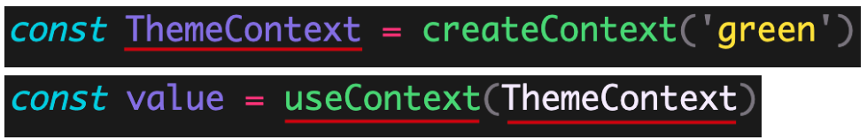

# React Hooks进阶

- [ ] useState 回调函数形式的参数
- [ ] useEffect 清理副作用
- [ ] useRef操作DOM
- [ ] useContext组件通讯

## useState-回调函数参数

**目标：**能够给useState通过回调函数的形式给useState提供初始参数。

**内容：**

useState 的参数可以有两种形式：

1. `useState(普通的数据)` => useState(0) / useState('abc')
2. `useState(回调函数)` => useState(() => { return 初始值 })
   1. 回调函数的返回值就是状态的初始值
   2. 该回调函数只会触发一次

```js
  // 使用 回调函数 来为 useState 初始化默认值
  // 回调函数的返回值就是状态的初始值！
  // 注意：该回调函数只会触发一次
  const [list, setList] = useState(() => {
    return JSON.parse(localStorage.getItem('comments')) || comments
  })
```

- 该使用哪种形式？
  1. 如果状态就是一个普通的数据（比如，字符串、数字、数组等）都可以直接使用 `useState(普通的数据)`
  2. 如果状态是经过一些计算得到的，此时，推荐使用 `useState(回调函数)`

```js
// 第一种：
const [list, setList] = useState(
  JSON.parse(localStorage.getItem('list')) || arr
)
// 可以转化为：
// 这种情况下，只要组件更新，此处的 localStorage 等操作就会重复执行
// const initList = JSON.parse(localStorage.getItem('list')) || comments
// const [list, setList] = useState(initList)

// 第二种：
// 这种方式，因为回调函数只会执行一次，所以，此处的 localStorage 等操作代码只会执行一次
const [list, setList] = useState(() => {
  return JSON.parse(localStorage.getItem('comments')) || comments
})

// 在这种情况下，推荐使用第二种方式
```

## useEffect清理副作用

**目标：**能够在组件卸载的时候，清除注册的事件

**内容：**

- effect 的返回值是可选的，可省略。也可以返回一个**清理函数**，用来执行事件解绑等清理操作
- 清理函数的执行时机：
  - **清理函数**会在组件卸载时以及下一次副作用回调函数调用的时候执行，用于清除上一次的副作用。
  - 如果依赖项为空数组，那么会在组件卸载时会执行。相当于组件的`componetWillUnmount`
- 推荐：一个 useEffect 只处理一个功能，有多个功能时，使用多次 useEffect 

**核心代码：**

```jsx
useEffect(() => {
  const handleResize = () => {}
  window.addEventListener('resize', handleResize)
  
  // 这个返回的函数，会在该组件卸载时来执行
  // 因此，可以去执行一些清理操作，比如，解绑 window 的事件、清理定时器 等
  return () => window.removeEventListener('resize', handleResize)
})
```

## 案例-获取当前鼠标位置

**目标：**能够实现案例，让图片跟随鼠标移动

**内容：**

+ 通过useState提供状态
+ 通过useEffect给document注册鼠标移动事件
+ 在组件销毁的时候清理副作用

```jsx
import { useEffect, useState } from 'react'
import img from './1.gif'
export default function Move() {
  const [position, setPosition] = useState({
    x: 0,
    y: 0
  })
  useEffect(() => {
    const move = (e) => {
      console.log('移动')

      setPosition({
        x: e.pageX,
        y: e.pageY
      })
    }
    document.addEventListener('mousemove', move)
    console.log('注册事件')
    return function () {
      document.removeEventListener('mousemove', move)
    }
  }, [])
  return (
    <div>
      
    </div>
  )
}

```

## 自定义hooks

**目标：**能够使用自定义hooks实现状态的逻辑复用

**内容：**

除了使用内置的 Hooks 之外，还可以创建自己的 Hooks（自定义 Hooks）。 useXxx

使用场景：**将组件状态逻辑提取到可重用的函数（自定义 Hooks）中，实现状态逻辑复用。**

内置 Hooks 为函数组件赋予了 class 组件的功能；在此之上，自定义 Hooks 针对不同组件实现不同状态逻辑复用。

+ 自定义 Hooks 是一个函数，**约定函数名称必须以 use 开头，React 就是通过函数名称是否以 use 开头来判断是不是 Hooks**
+ Hooks 只能在函数组件中或其他自定义 Hooks 中使用，否则，会报错！
+ 自定义 Hooks 用来提取组件的状态逻辑，根据不同功能可以有不同的参数和返回值（就像使用普通函数一样）

**核心代码**

```jsx
// 使用hooks实现猫跟着鼠标移动
import { useEffect, useState } from 'react'
export default function useMouse() {
  const [position, setPosition] = useState({
    x: 0,
    y: 0,
  })

  useEffect(() => {
    const move = (e) => {
      setPosition({
        x: e.pageX,
        y: e.pageY,
      })
    }
    document.addEventListener('mousemove', move)
    return () => {
      document.removeEventListener('mousemove', move)
    }
  }, [])
  return position
}

```


## useEffect发送请求

**目的：**能够在函数组件中通过useEffect发送ajax请求

**内容：**

+ 在组件中，使用 useEffect Hook 发送请求获取数据（side effect）：

+ 注意：**effect 只能是一个同步函数，不能使用 async**
+ 如果 effect 是 async 的，此时返回值是 Promise 对象。这样的话，就无法保证清理函数被立即调用
+ 为了使用 async/await 语法，可以在 effect 内部创建 async 函数，并调用

**核心代码：**

```jsx
// 错误演示：

// 不要给 effect 添加 async
useEffect(async () => {
    const res = awiat xxx()
    return ()=> {
        
    }
}, [])

// 正确使用
useEffect(() => {

  async function fetchMyAPI() {
    let url = 'http://something/' + productId
    let config = {}
    const response = await myFetch(url)
  }

  fetchMyAPI()
}, [productId])
```

## useRef-操作DOM

**目标：**能够使用useRef操作DOM

**内容：** 

使用场景：在 React 中进行 DOM 操作时，用来获取 DOM

作用：**返回一个带有 current 属性的可变对象，通过该对象就可以进行 DOM 操作了。**

```jsx
const inputRef = useRef(null)
```

解释：

+ 参数：在获取 DOM 时，一般都设置为 null
+ 返回值：包含 current 属性的对象。

+ 注意：只要在 React 中进行 DOM 操作，都可以通过 useRef Hook 来获取 DOM（比如，获取 DOM 的宽高等）。

+ 注意：useRef不仅仅可以用于操作DOM，还可以操作组件

**核心代码：**

```JSX
/* 
  1. 使用useRef能够创建一个ref对象，  有current属性  {current: null}
    const xxRef = useRef(null)
  
  2. 通过ref属性关联到某个DOM对象上  {current: DOM}
    <div ref={xxRef}></div>
  
  3. 可以通过 xxRef.current访问到对应的DOM
*/
const App = () => {
  const inputRef = useRef(null)
  const add = () => {
    console.log(inputRef.current.value)
  }
  return (
    <section className="todoapp">
      <input type="text" placeholder="请输入内容" ref={inputRef} />{' '}
      <button onClick={add}>添加</button>
    </section>
  )
}

export default App
```


## useContext-context基础

**目标：回顾context跨级组件通讯的使用**

**内容：**

使用场景：跨组件共享数据。

Context 作用：实现跨组件传递数据，而不必在每个级别手动传递 props，简化组件之间的数据传递过程


Context 对象包含了两个组件

+ <Context.Provider value>：通过 value 属性提供数据。

+ <Context.Consumer>：通过 render-props 模式，在 JSX 中获取 Context 中提供的数据。


注意：

1. 如果提供了 Provider 组件，Consumer 获取到的是 Provider 中 value 属性的值。
2. 如果没有提供 Provider 组件，Consumer 获取到的是 createContext(defaultValue) 的 defaultValue 值。

## useContext-使用

**目标：**能够通过useContext hooks实现跨级组件通讯

**内容：**

作用：在函数组件中，获取 Context 中的值。要配合 Context 一起使用。

`useContext Hook` 与` <Context.Consumer>` 的区别：获取数据的位置不同，

+ `<Context.Consumer>`：在 JSX 中获取 Context 共享的数据。
+ useContext：在 JS 代码中获取 Context 的数据。



解释：

+ useContext 的参数：Context 对象，即：通过 createContext 函数创建的对象。
+ useContext 的返回值：Context 中提供的 value 数据。

## 购物车案例

### 发送请求-获取列表数据

**目标：**发送请求，获取到购物车数据

**步骤**

1. 安装axios
2. 使用useState hooks提供状态
3. 使用useEffect发送请求获取数据

**核心代码**

+ 安装axios

```bash
yarn add axios
```

+ 发送请求，获取数据

```jsx
useEffect(() => {
  // 判断本地是否有数据
  const arr = JSON.parse(localStorage.getItem('list')) || []
  if (arr.length) {
    return setList(arr)
  }
  // 本地没有数据，发送请求，获取数据
  const getList = async () => {
    const res = await axios.get('https://www.escook.cn/api/cart')
    setList(res.data.list)
  }
  getList()
}, [])
```

### MyCount组件的封装

+ 基本结构

```jsx
import React from 'react'
import './index.scss'
export default function MyCount() {
  return (
    <div className="my-counter">
      <button type="button" className="btn btn-light">
        -
      </button>
      <input type="number" className="form-control inp" value="1" />
      <button type="button" className="btn btn-light">
        +
      </button>
    </div>
  )
}

```

+ 样式

```scss
.my-counter {
  display: flex;
  .inp {
    width: 45px;
    text-align: center;
    margin: 0 10px;
  }
}

```

+ 在GoodsItem组件中渲染

```jsx
import MyCount from '../MyCount'

<MyCount></MyCount>
```

### 数量控制-useContext

**目标：**使用useContext优化组件的通讯

**步骤**

1. 在App.js中创建Context对象，并且导出

```jsx
export const Context = createContext()
```

2. 在App.js中，通过Provider提供方法

```jsx
<Context.Provider value={{ changeCount }}>
  <div className="app">
    <MyHeader>购物车</MyHeader>

    {list.map((item) => (
      <GoodsItem
        key={item.id}
        {...item}
        changeState={changeState}
        changeCount={changeCount}
      ></GoodsItem>
    ))}

    <MyFooter list={list} changeAll={changeAll}></MyFooter>
  </div>
</Context.Provider>
```

3. 在myCount组件中，使用useContext获取数据

```jsx
import { Context } from '../../App'

const { changeCount } = useContext(Context)
```


### 数量的控制


### 

