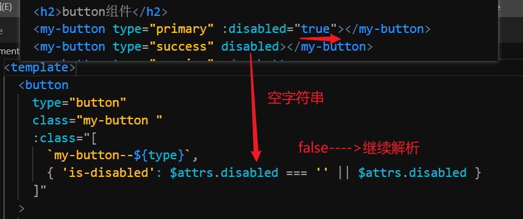
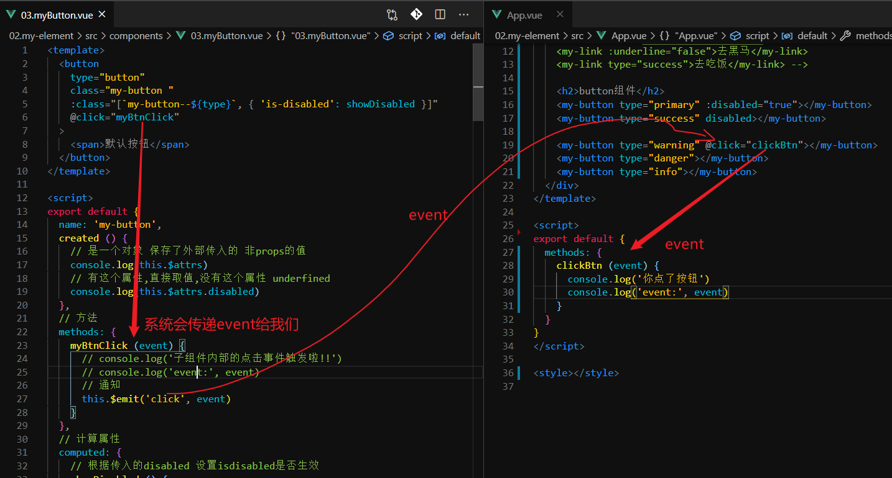

## 反馈

1.	以后注册组件都用异步组件注册吗
   1.	路由里面都用懒加载
   1.	页面组件还是普通 模式
1.	飞飞哥，感觉面试好难啊，61期见
1.	不知道说啥，那就祝飞飞老师永远这么可爱吧哈哈哈哈哈哈哈哈哈哈哈哈
1.	大家好我是MC文文 快毕业了祝大家早日收到offer 回来黑马的时候记得带杯柠檬水 我在63期等你
1.	出去工作做PC端还是移动端项目可能性比较大,做什么类型的比较多?后台管理还是啥
   1.	pc管理系统 多一些,增删改查,  业务逻辑还是少不了,
1.	var debounce = function(func, delay) { var timer = null; return function(...args) { if (timer) { clearTimeout(timer); } timer = setTimeout(() => { func.apply(this, args); }, delay); }; }; window.addEventListener("scroll", debounce(func, delay)); 老师，这个防抖里面的arguments是什么有点不懂，可以讲一下吗
1.	飞哥 我们现在这个水平出去能接得住大部分活吗 感觉我们像什么都不会 又感觉会 出去做的项目大概难易程度是什么样呢 人多的公司好还是人少的公司好呢 飞哥辛苦了
   1.	大部分活没有问题的,头一个月较辛苦

## 回顾

- set

  - ~~~
    数组修改它只能识别长度变化 
    对象:以前存在的,修改它的值它会识别,但是新增属性它不会识别
    ~~~

  - ~~~
    this.$set(对象或者数组,"key值或者数组的索引",修改后的值)
    ~~~

- 特性继承

  - props传值(父传子)

    - 只做了传没有做收它会把传过来的属性加到子组件最外层
    - inheritAttes:true在最外层能显示false不在最外层显示

  - $attrs:可以拿到非props传参

  - $listeners:可以拿到所有父传过来的方法

  - $attrs与$lsiteners可以将继承过来的方法与属性传递给子组件

    - v-bind="$attrs"
    - v-on="$listeners"

  - bus

    - main.js
      - Vue.prototype.$bus=new Vue()
    - 监听
      - this.$bus.$on("方法名",(参数)=>{})
    - 触发监听
      - this.$bus.$emit("方法名",参数)

  - provide与inject

    - 用于跨级传值

    - 传:

      - ~~~
        provide(){
            return {
              名字:值
            }
        }
        ~~~

    - 收:

      - inject:["名字"]

    - 单向数据流:原始值不能修改,引用值只要不修改它的引用,它的属性随便修改


## 补充 - 插槽

> 概念：在父组件中，使用子组件时，子组件中的内容可能是固定的。但是有时候又需要将子组件中固定的内容进行替换。就可以使用插槽。

+ 基本使用

  + 在子组件中设置插槽

    ```html
    <div>
        我是头部
    </div>
    <div>
        <slot>我的内容</slot>
    </div>
    <div>
        我是底部
    </div>
    ```

  + 在父组件中替换插槽中的内容

    ```html
    <son>default body</son>
    ```

    

+ 具名插槽

  > 如果一个组件内部有多个需要被替换的部分，可以使用具名插槽

  

+ 默认插槽

  > 如果不给插槽设置 name 属性，那么将父组件中的默认内容就是用来替换这个不设置 name 属性的内容

  

+ 作用域插槽

  > 如果希望在父组件中的插槽中使用到子组件中对应插槽的数据源，可以使用作用域插槽（子组件 slot 中用到的数组中可以传给父组件来使用）

  


## 补充:计算属性传参

- 计算属性:

  - 使用场景:依赖一个或者多个值产生的一个新的值

    - 特点:可以当属性使用,不可修改,它会缓存它的值

    - ~~~
      computed:{
         方法名(){
            return 值
         }
      }
      ~~~

- 计算属性传参

     1:将计算属性return的值变成一个function 该function可以接收参数

  ​       xxxset () {  

  ​          return (参数) => {

  ​            return this.xxx + 参数

  ​          }

  ​        }

     2:使用时:计算属性名(参数) 这样它就可以调用计算属性内return的function并传递参数

  ​      {{ xxxset(参数) }}


## 补充:mapGetters

- getters就是vuex的计算属性
  - 依赖state的值产生了一个新值


## 需求 - 按钮

> 按钮组件也非常常见,咱们来实现一个

[Element-button](https://element.eleme.cn/#/zh-CN/component/button)

**需求:**

1. 实现`Element`中按钮的功能


**属性:**

| 参数     | 说明     | 类型    |               可选值                | 默认值 |
| -------- | -------- | ------- | :---------------------------------: | :----: |
| type     | 按钮类型 | string  | primary/success/warning/danger/info |   -    |
| disabled | 是否禁用 | boolean |                  -                  | false  |

**事件:**

| 事件名 | 说明     | 事件参数     |
| ------ | -------- | ------------ |
| click  | 点击事件 | 原生事件参数 |

**插槽:**

| 插槽名  | 说明     |
| ------- | -------- |
| default | 文本区域 |

**基本结构:**

```vue
<template>
  <button type="button" class="my-button my-button--primary is-disabled">
    <span>默认按钮</span>
  </button>
</template>

<script>
export default {}
</script>

<style lang="less">
.my-button {
  display: inline-block;
  line-height: 1;
  white-space: nowrap;
  cursor: pointer;
  background: #fff;
  border: 1px solid #dcdfe6;
  color: #606266;
  -webkit-appearance: none;
  text-align: center;
  box-sizing: border-box;
  outline: none;
  margin: 0;
  transition: 0.1s;
  font-weight: 500;
  -moz-user-select: none;
  -webkit-user-select: none;
  -ms-user-select: none;
  padding: 12px 20px;
  font-size: 14px;
  border-radius: 4px;

  &:focus,
  &:hover {
    color: #409eff;
    border-color: #c6e2ff;
    background-color: #ecf5ff;
  }
  // 禁用状态
  &.is-disabled,
  :hover.is-disabled {
    color: #c0c4cc;
    cursor: not-allowed;
    background-image: none;
    background-color: #fff;
    border-color: #ebeef5;
  }
  // 朴素按钮的状态
  &.is-plain:hover {
    background: #fff;
    border-color: #409eff;
    color: #409eff;
    &.is-disabled {
      color: #c0c4cc;
      cursor: not-allowed;
      background-image: none;
      background-color: #fff;
      border-color: #ebeef5;
    }
  }
  // 主要按钮的样式
  &.my-button--primary {
    color: #fff;
    background-color: #409eff;
    border-color: #409eff;
    // hover状态
    &:hover {
      background: #66b1ff;
      border-color: #66b1ff;
      color: #fff;
    }
    // 禁用状态
    &.is-disabled {
      color: #fff;
      background-color: #a0cfff;
      border-color: #a0cfff;
    }
    // 朴素状态
    &.is-plain {
      color: #409eff;
      background: #ecf5ff;
      border-color: #b3d8ff;
      &:hover {
        background: #409eff;
        border-color: #409eff;
        color: #fff;
      }
      &.is-disabled {
        color: #8cc5ff;
        background-color: #ecf5ff;
        border-color: #d9ecff;
      }
    }
  }
  // 成功按钮的样式
  &.my-button--success {
    color: #fff;
    background-color: #67c23a;
    border-color: #67c23a;
    // hover状态
    &:hover {
      background: #85ce61;
      border-color: #85ce61;
      color: #fff;
    }
    &.is-disabled {
      color: #fff;
      background-color: #b3e19d;
      border-color: #b3e19d;
    }
    // 朴素状态
    &.is-plain {
      color: #67c23a;
      background: #f0f9eb;
      border-color: #c2e7b0;
      &:hover {
        background: #67c23a;
        border-color: #67c23a;
        color: #fff;
      }
      &.is-disabled {
        color: #a4da89;
        background-color: #f0f9eb;
        border-color: #e1f3d8;
      }
    }
  }
  // 信息按钮的样式
  &.my-button--info {
    color: #fff;
    background-color: #909399;
    border-color: #909399;
    &:hover {
      background: #a6a9ad;
      border-color: #a6a9ad;
      color: #fff;
    }
    &.is-disabled {
      color: #fff;
      background-color: #c8c9cc;
      border-color: #c8c9cc;
    }
    // 朴素状态
    &.is-plain {
      color: #909399;
      background: #f4f4f5;
      border-color: #d3d4d6;
      &:hover {
        background: #909399;
        border-color: #909399;
        color: #fff;
      }
      &.is-disabled {
        color: #bcbec2;
        background-color: #f4f4f5;
        border-color: #e9e9eb;
      }
    }
  }
  // 警告按钮的样式
  &.my-button--warning {
    color: #fff;
    background-color: #e6a23c;
    border-color: #e6a23c;
    &:hover {
      background: #ebb563;
      border-color: #ebb563;
      color: #fff;
    }
    &.is-disabled {
      color: #fff;
      background-color: #f3d19e;
      border-color: #f3d19e;
    }
    // 朴素状态
    &.is-plain {
      color: #e6a23c;
      background: #fdf6ec;
      border-color: #f5dab1;
      &:hover {
        color: #e6a23c;
        background: #fdf6ec;
        border-color: #f5dab1;
      }
      &.is-disabled {
        color: #f0c78a;
        background-color: #fdf6ec;
        border-color: #faecd8;
      }
    }
  }
  // 危险按钮的样式
  &.my-button--danger {
    color: #fff;
    background-color: #f56c6c;
    border-color: #f56c6c;
    &:hover {
      background: #f78989;
      border-color: #f78989;
      color: #fff;
    }
    &.is-disabled {
      color: #fff;
      background-color: #fab6b6;
      border-color: #fab6b6;
    }
    // 朴素状态
    &.is-plain {
      color: #f56c6c;
      background: #fef0f0;
      border-color: #fbc4c4;
      &:hover {
        background: #f56c6c;
        border-color: #f56c6c;
        color: #fff;
      }
      &.is-disabled {
        color: #f9a7a7;
        background-color: #fef0f0;
        border-color: #fde2e2;
      }
    }
  }

  // 圆角按钮
  &.is-round {
    border-radius: 20px;
    padding: 12px 23px;
  }

  // 兄弟的间隙
  & + .my-button {
    margin-left: 10px;
  }
}
</style>

```


### 实现 - 按钮 - 属性

> 咱们先来实现属性部分的内容

实现步骤:

1. `disabled`是原生属性,建议直接从外部传入,不需要`props`
2. `props`中定义`type`
   1. validator
3. 和之前的实现方式基本一致



注意:

1. `$attrs`可以获取到所有非`props`的属性
2. 是一个对象
3. `disabled`传入时,如果没有赋值,默认是`空字符换`
4. 绑定`is-disabled`类名时,用了逻辑短路运算
   1. `表达式1  || 表达式2`
   2. 表达式1如果为true,直接返回
   3. 表达式1如果为false,就会继续解析表达式2
5. 可读性好--->逼格低
6. 逼格高---->可读性低
   1. 日常编码中,建议`可读性高`
   2. 抽取的功能模块中,建议`逼格高`


**直接行内表达式写**

```vue
<template>
  <button
    type="button"
    class="my-button "
    :class="[
      `my-button--${type}`,
      { 'is-disabled': $attrs.disabled === '' || $attrs.disabled }
    ]"
  >
    <span>默认按钮</span>
  </button>
</template>

<script>
export default {
  name: 'my-button',
  created () {
    // 是一个对象 保存了外部传入的 非props的值
    console.log(this.$attrs)
    // 有这个属性,直接取值,没有这个属性 underfined
    console.log(this.$attrs.disabled)
  },
  props: {
    // 类型
    type: {
      type: String,
      validator (value) {
        const arr = ['primary', 'success', 'warning', 'danger', 'info']
        return arr.indexOf(value) !== -1
      }
    }
  }
}
</script>


```


### 实现 - 按钮 - 事件

> 接下来咱们来实现按钮的事件部分

实现步骤:

1. 父组件要能够绑定事件
2. 组件内部必须通过`this.$emit`触发对应的事件
3. 内部绑定一个`click`
   1. 直接通知父组件即可


注意:

1. 子组件内部检测的是`click`这里不能乱写
2. 通过`emit`通知父组件时,事件名可以自定义,只要有意义即可
3. 基本功能类组件建议使用和原生事件同名的命名
   1. 按钮的点击事件`click`




### 实现 - 按钮 - 插槽

> 最后我们把插槽部分的内容整合进来

实现步骤:

1. slot

   

### 知识点 - 原生事件

> 对于`html`标签的原生属性,`vue`内部也会帮我们处理一下,

[原生事件绑定](https://cn.vuejs.org/v2/guide/components-custom-events.html#%E5%B0%86%E5%8E%9F%E7%94%9F%E4%BA%8B%E4%BB%B6%E7%BB%91%E5%AE%9A%E5%88%B0%E7%BB%84%E4%BB%B6)

注意:

1. 使用这种写法直接出发父组件传递进来的逻辑
2. 我们不再需要在`methods`中定义内容了进一步简化编码


### 调整 - 按钮 - 原生事件绑定

> 点击事件是原生事件,我们还要那么麻烦的触发


步骤:

1. 通过`$listeners`获取传入的`click`


自己内部定义了`methods`

```vue
<template>
  <button
    type="button"
    class="my-button "
    :class="[`my-button--${type}`, { 'is-disabled': showDisabled }]"
    @click="myBtnClick"
  >
    <span>
      <slot></slot>
    </span>
  </button>
</template>

<script>
export default {
  name: 'my-button',
  created () {
    // 是一个对象 保存了外部传入的 非props的值
    console.log(this.$attrs)
    // 有这个属性,直接取值,没有这个属性 underfined
    console.log(this.$attrs.disabled)
  },
  // 方法
  methods: {
    myBtnClick (event) {
      // console.log('子组件内部的点击事件触发啦!!')
      // console.log('event:', event)
      // 通知
      this.$emit('click', event)
    }
  },
  // 计算属性
  computed: {
    // 根据传入的disabled 设置isdisabled是否生效
    showDisabled () {
      if (this.$attrs.disabled === '') {
        return true
      } else {
        return this.$attrs.disabled
      }
    }
  },
  props: {
    // 类型
    type: {
      type: String,
      validator (value) {
        const arr = ['primary', 'success', 'warning', 'danger', 'info']
        return arr.indexOf(value) !== -1
      }
    }
  }
}
</script>

```


## 组件之v-model

-  `v-model`实际就是`props`与`emit`的语法糖(只针对父组件的`props`与`emit`写法减化)
  -  要求:

    1. props传值属性名一定要是value 

    2. 绑定的方法一定要是@input方法,该方法一定只做了一件事,接收一个参数,修改value对应的值为该参数

        该二步满足条件就可以使用v-model="value对应的值"做一个减化(只是减化父组件写法)

    **父组件**

    ~~~vue
    <template>
      <div>
        <pre>
           需求:有一个组件能够生成随机数,父组件能修改它,子组件内部有个按钮也能修改它
           v-model实际就是props与emit的语法糖(只针对父组件的props与emit写法减化)
             要求:
               1:props传值一定要是value 
               2:绑定的方法一定要是@input方法,该方法一定只做了一件事,接收一个参数,修改value对应的值为该参数
               该二步可以使用v-model="value对应的值"做一个减化
                
       </pre
        >
        <!-- <randomNum :value="valueNum" @input="inputEvent"></randomNum> -->
        <randomNum v-model="valueNum"></randomNum>
      </div>
    </template>
    <script>
    import randomNum from './10/randomNum'
    export default {
      components: {
        randomNum
      },
      data () {
        return {
          valueNum: 4321
        }
      },
      methods: {
        // inputEvent (num) {
        //   this.valueNum = num
        // }
      }
    }
    </script>
    <style></style>
    
    ~~~

    **子组件`randomNum`**

  ~~~vue
  <template>
    <div>
      <div>{{ value }}</div>
      <button @click="setNum">修改随机数</button>
    </div>
  </template>
  <script>
  export default {
    props: ['value'],
    methods: {
      setNum () {
        this.$emit('input', Math.ceil(Math.random() * 999))
      }
    }
  }
  </script>
  <style></style>
  
  ~~~

  

  

## 需求 - 输入框组件

> 接下来我们通过输入框组件来巩固双向数据绑定数据

[自定义组件的v-model](https://cn.vuejs.org/v2/guide/components-custom-events.html#%E8%87%AA%E5%AE%9A%E4%B9%89%E7%BB%84%E4%BB%B6%E7%9A%84-v-model)


注意:

1. `v-model`本质是
   1. :value绑定value值
   2. @input绑定事件,事件中修改data中的值


**结构:**

```html
<template>
  <div class="my-input ">
    <input
      type="text"
      autocomplete="off"
      placeholder="请输入内容"
      class="my-input__inner"
    />
  </div>
</template>
```


**样式:**

```html
<style lang="less">
  .my-input {
    width: 180px;
    position: relative;
    font-size: 14px;
    display: inline-block;
    // width: 100%;
    &.my-input-password {
      .my-input__inner {
        padding-right: 30px;
      }
    }
    .my-input__inner {
      -webkit-appearance: none;
      cursor: pointer;
      background-color: #fff;
      background-image: none;
      border-radius: 4px;
      border: 1px solid #dcdfe6;
      box-sizing: border-box;
      color: #606266;
      display: inline-block;
      font-size: inherit;
      height: 40px;
      line-height: 40px;
      outline: none;
      padding: 0 15px;
      transition: border-color 0.2s cubic-bezier(0.645, 0.045, 0.355, 1);
      width: 100%;
    }
    &.is-disabled .my-input__inner {
      background-color: #f5f7fa;
      border-color: #e4e7ed;
      color: #c0c4cc;
      cursor: not-allowed;
      // placeholder兼容样式处理
      &::-webkit-input-placeholder {
        color: #c0c4cc;
      }
      &::-moz-input-placeholder {
        color: #c0c4cc;
      }
      &::-ms-input-placeholder {
        color: #c0c4cc;
      }
    }
    .iconfont {
      position: absolute;
      height: 100%;
      right: 5px;
      top: 0;
      text-align: center;
      color: #c0c4cc;
      transition: all 0.3s;
      line-height: 40px;
    }
  }
</style>
```


**参数:**

| 参数        | 说明           | 类型          | 可选值 | 默认值 |
| ----------- | -------------- | ------------- | ------ | ------ |
| v-model     | 双向绑定的数据 | string/number | -      | -      |
| placeholder | 输入框占位文本 | string        | -      | -      |

**事件:**

| 事件名 | 说明         | 参数     |
| ------ | ------------ | -------- |
| blur   | 失去焦点触发 | 事件参数 |
| focus  | 获得焦点触发 | 事件参数 |


### 实现 - 输入框 - v-model

> 咱们先来实现输入框的`v-model`

[$event 监听子组件的参数](https://cn.vuejs.org/v2/guide/components.html#%E4%BD%BF%E7%94%A8%E4%BA%8B%E4%BB%B6%E6%8A%9B%E5%87%BA%E4%B8%80%E4%B8%AA%E5%80%BC)

实现步骤:

1. props中定义`value`属性从外部传入
2. 子组件的内部响应`input`时间,通知父组件`$emit(input)`
3. type来限制类型
   1. 可以通过数组来设置多个类型


```vue
<template>
  <div class="my-input ">
    <input
      type="text"
      autocomplete="off"
      placeholder="请输入内容"
      class="my-input__inner"
      :value="value"
      @input="input"
    />
  </div>
</template>
<script>
export default {
  name: 'my-input',
  props: {
    value: {
      type: [Number, String]
    }
  },
  methods: {
    input (event) {
      // 希望外部用`v-model`必须使用`input`
      // 把自己的最新的value传递出去
      this.$emit('input', event.target.value)
    }
  }
}
</script>
```


注意:

1. 行内如果要获取参数可以使用`$event`来获取

2. 只要满足v-model的2个条件就可以简化为`v-model`

3. 面试问及`v-model`

   1. 本质就是value的绑定,input事件的绑定

   

### 实现 - 输入框 - 属性

> 接下来我们来实现属性部分的功能


1. props定义值
2. 接收外部传入的值
3. 在组件中使用即可


### 实现 - 输入框 - 事件

> 最后我们来实现输入框事件部分的内容

实现步骤:

1. 内部绑定事件
2. `$emit('事件名',参数)`即可


## Vue.extend方法

> 如果要实现通过方法调用的弹框组件需要怎么做呢?咱们先来看看如何动态的渲染组件到页面上

[Vue.extend](https://cn.vuejs.org/v2/api/#Vue-extend)

[vm.$mount](https://cn.vuejs.org/v2/api/#vm-mount)

[vm.$el](https://cn.vuejs.org/v2/api/#vm-el)


1. `Vue.extend(组件对象)`
   1. 返回的是一个构造函数
   2. 不能直接使用,还需要实例化
   3. 实例化出来的就是包含传入的组件特性的实例化对象
2. `$mount`
   1. `$mount(选择器)`
      1. 直接找到对应的dom元素并把组件添加进去
      2. 但是`html,body`会有异常提示
   2. `$mount()`
      1. 基于组件的`template`生成对应的结构`dom`
      2. `$el`可以获取到
3. 直接添加到希望添加的位置即可


## 需求 - message组件

> 简短的提示我们可以用`message`组件来实现,该组件的使用是通过方法哦

[Element - message](https://element.eleme.cn/#/zh-CN/component/message)


**参数:**

| 参数     | 参数说明          | 类型   | 可选值 | 默认值 |
| -------- | ----------------- | ------ | ------ | ------ |
| title    | 标题              | string | -      | 标题   |
| duration | 多久之后消失,毫秒 | number | -      | 1000   |

**需求:**

1. 可以在任意的`vue实例`上通过`$message`调用
2. 消失之后直接从`dom`树中移除
3. 参数的传递用对象的形式`this.$message({title:"标题",duration:3000})`


**基本结构:**

```vue
<template>
  <div class="my-message my-message--info">
    <i class="my-message__icon iconfont icon-info"></i>
    <p class="my-message__content">标题</p>
  </div>
</template>

<script>
export default {}
</script>

<style lang="less">
.my-message {
  min-width: 380px;
  -webkit-box-sizing: border-box;
  box-sizing: border-box;
  border-width: 1px;
  border-style: solid;
  border-color: #ebeef5;
  position: fixed;
  z-index: 9999;
  left: 50%;
  top: 20px;
  transform: translateX(-50%);
  background-color: #edf2fc;
  padding: 15px 15px 15px 20px;
  display: -webkit-box;
  display: -ms-flexbox;
  display: flex;
  -webkit-box-align: center;
  -ms-flex-align: center;
  align-items: center;
  // 根据类型设置不同的外观
  &.my-message--info {
    color: #909399;
  }
  // success
  &.my-message--success {
    background-color: #f0f9eb;
    border-color: #e1f3d8;
    .my-message__icon {
      color: #67c23a;
    }
    .my-message__content {
      color: #67c23a;
    }
  }
  // warning
  &.my-message--warning {
    background-color: #fdf6ec;
    border-color: #faecd8;
    .my-message__icon {
      color: #e6a23c;
    }
    .my-message__content {
      color: #e6a23c;
    }
  }
  // error
  &.my-message--error {
    background-color: #fef0f0;
    border-color: #fde2e2;
    .my-message__icon {
      color: #f56c6c;
    }
    .my-message__content {
      color: #f56c6c;
    }
  }
  .my-message__icon {
    margin-right: 10px;
  }
  .my-message__content {
    padding: 0;
    font-size: 14px;
    line-height: 1;
    margin: 0;
  }
}
</style>

```


## 实现 - message组件

> 结合上面分析的这几个方法,咱们来实现一下`message`组件

**message.vue**

~~~vue
<template>
  <transition name="xxx">
    <div class="my-message" v-show="isShow" :class="'my-message--' + type">
      <i class="my-message__icon iconfont" :class="'icon-' + type"></i>
      <p class="my-message__content">{{ title }}</p>
    </div>
  </transition>
</template>
<script>
export default {
  data () {
    return {
      type: 'info',
      title: '',
      duration: 1000,
      isShow: false
    }
  },
  created () {},
  methods: {
    show () {
      this.isShow = true
      setTimeout(() => {
        this.isShow = false
        setTimeout(() => {
          document.body.removeChild(this.$el)
        }, 500)
      }, this.duration)
    }
  }
}
</script>
<style lang="less" scoped>
.my-message {
  min-width: 380px;
  -webkit-box-sizing: border-box;
  box-sizing: border-box;
  border-width: 1px;
  border-style: solid;
  border-color: #ebeef5;
  position: fixed;
  z-index: 9999;
  left: 50%;
  top: 20px;
  transform: translateX(-50%);
  background-color: #edf2fc;
  padding: 15px 15px 15px 20px;
  display: -webkit-box;
  display: -ms-flexbox;
  display: flex;
  -webkit-box-align: center;
  -ms-flex-align: center;
  align-items: center;
  // 根据类型设置不同的外观
  &.my-message--info {
    color: #909399;
  }
  // success
  &.my-message--success {
    background-color: #f0f9eb;
    border-color: #e1f3d8;
    .my-message__icon {
      color: #67c23a;
    }
    .my-message__content {
      color: #67c23a;
    }
  }
  // warning
  &.my-message--warning {
    background-color: #fdf6ec;
    border-color: #faecd8;
    .my-message__icon {
      color: #e6a23c;
    }
    .my-message__content {
      color: #e6a23c;
    }
  }
  // error
  &.my-message--error {
    background-color: #fef0f0;
    border-color: #fde2e2;
    .my-message__icon {
      color: #f56c6c;
    }
    .my-message__content {
      color: #f56c6c;
    }
  }
  .my-message__icon {
    margin-right: 10px;
  }
  .my-message__content {
    padding: 0;
    font-size: 14px;
    line-height: 1;
    margin: 0;
  }
}
.xxx-enter-active,
.xxx-leave-active {
  transition: all 0.5s;
}
.xxx-enter {
  opacity: 0;
}
.xxx-leave-to {
  opacity: 0;
}
</style>

~~~

main.js中处理全局$message

~~~js
import message from '@/components/message'

Vue.prototype.$message = function ({ type, title, duration }) {
  const messageFn = Vue.extend(message)
  const messageObj = new messageFn()
  messageObj.type = type
  messageObj.title = title
  messageObj.duration = duration
  messageObj.$mount()
  document.body.appendChild(messageObj.$el)
  messageObj.show()
}
~~~

**调用**

~~~js
      this.$message({
        type: 'success',
        duration: 5000,
        title: '我是新来的' + Date.now()
      })
~~~


## 补充 - 双向绑定的原理

基本概念：

+ 当视图上的数据发生改变时， data 中的数据也发生改变
+ 当 data 中的数据发生改变时，视图中的数据也发生改变

原理：

+ 主流使用的版本 2.x：

  + 关键字：`Object.defineProperty`

    ```js
    var data = {}
    document.querySelector('#ipt').oninput = function(e) {
    	data.name = e.target.value
    }
    Object.defineProperty(data, 'name', {
    	set: function(value) {
    		this._name = value
    		document.querySelector('#box').innerHTML = value
            document.querySelector('#ipt').value = value
    	},
    	get: function() {
    		return this._name
    	}
    })
    ```

+ 最新的版本 3.x

  + 关键字： `Proxy`

+ 注意点：

  + 我们这里讲的实现原理是实现的方法，其实在 vue 底层实现这玩意儿的时候用到一种模式：观察者模式。

