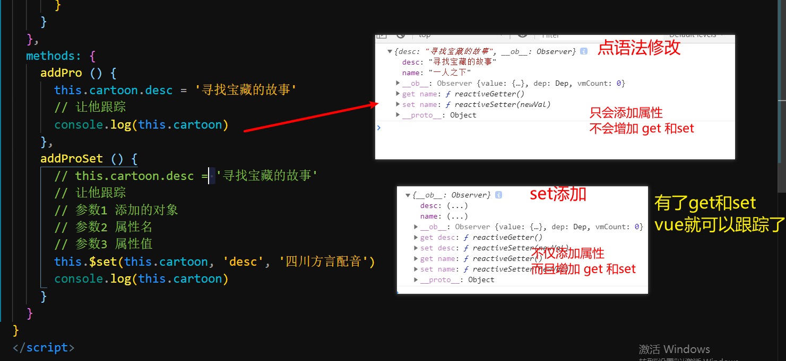

# day2-进阶

## 反馈

1. 移动端答题还是挺难的，工作中做这种高难度的多吗， 万一进去就做这种，那肯定得被开除了， 就算能做出来也会很慢

1. 老师您经验丰富，想请您多分享点前端开发里面的坑，特别是vue里面的

   1. 路由配错,component,  

   1. 同一路由地址路由跳转

   1. 数组更新与对亲新增属性添加不渲染到页面

   1. $parent找父组件,如果该组件外面 又包了一层组件

   1. props传值是单向数据流

      1. 栈不可修改,堆随便修改

         1.	原始值不能修改,引用值不修改它的引用,其它属性随便修改

      1. ~~~
         <xxx :a="{b:10}"/>
         xxx组件内接收
            props:["a"]
            button  点击修改a  @click="a={b:20}"
         ~~~

      1.	

1. 老师, 配置publicPath:'./' 这个只是项目打包才用到吗,开发的时候无需用到?

1. 老师能不能讲讲代码回滚

   1. ~~~
      git reset --hard 版本号
      git log --oneline
      ~~~

   1. 

1. 飞哥np

1. fullpath和path有点模糊

   1.	this.$router.push("/hone/questionInfo?id=123&city=全国")
   1.	在questionInfo.vue取相应值
      1.	fullPath:this.$route.fullPath===/hone/questionInfo?id=123&city=全国
      1.	path:this.$route.path===/hone/questionInfo

1. npm run build 打包后 用live serve 运行为什么不存在 跨域问题????

   1. 接口做了处理,接口允许跨域

   1. 协议

   1.	端口

   1.	域名

   1.	开发环境:希望前端解决,你也可以要求后端解决

      1.	proxy:服务器调用服务器接口不存在跨域

         1.	~~~
              devServer: {
                proxy: {
                // 调用的接口以/api开头就全部代理
                  '/api': {
                  // 真实访问路径(基地址)
                    target: '<url>',
                    ws: true,
                    changeOrigin: true
                  },
                  '/foo': {
                    target: '<other_url>'
                  }
                }
              }
            ~~~

         1.	

1. 今天的你我 怎样重复昨天的故事 这一张旧船票 能否登上你的客船

1. es6里面的class是什么

   1.	class字段:保留字段,类
   1.	function Person(){}

## 回顾

- webpack基本使用

  - npm init -y
  - npm i webpack webpack-cli@3.3.11 -D   
  - "build":"webpack 打包文件的路径"

- 配制模式

  - 创建一个js文件 vue.config.js
  - "build":"webpack --config vue.config.js"

- vue.config.js

  - ~~~
    const path=require("path")
    module.exports={
    // 入口
    entry:"路径",
    // 出口
    output:{
    filename:"[name][hash].js",
    path:path.join(__dirname,'dist')
    },
    mode:"development/production",
    resolve:{
        alias:{
        "@":path.join(__dirname,"src")
        },
        extensions:[".js",".vue",'.css']
    },
    devtool:"source-map",
    module:{
       rules:[
       {
       test:/\.css$/,
       use:["style-loader","css-loader"]
       },
      {
       test:/\.less$/,
       use:["style-loader","css-loader",'less-loader']
       }
       // 安装sass   npm i node-sass sass-loader -D
       {
       test:/\.scss$/,
       use:["style-loader","css-loader",'sass-loader']
       },
        {
       test:/\.(png|jpg|gif)$/,
       use:[{
          loader:"file-loader",
          options:{
          outputPath:"./img"
          }
       }]
       },
       {
       test:/\.vue/,
       use:["vue-loader"]
       }
       ]
    }
    }
    ~~~

  - 


## 补充-本地解决跨域小方法

> 本地电脑解决跨域的简单方法

1.开发环境（跨域问题），生产环境

1.在电脑上新建一个目录，例如：C:\MyChromeDevUserData

2:创建一个谷歌浏览器的快捷方式

3.在快捷方式上点击右键==》属性==》目标输入框里最后加上  --disable-web-security --user-data-dir=C:\MyChromeDevUserData，--user-data-dir的值就是刚才新建的目录。

3.点击应用和确定后关闭属性页面，并打开chrome浏览器。

再次打开chrome，发现有“--disable-web-security”相关的提示，说明chrome又能正常跨域工作了。


## 补充

### 补充 - 准备工作

使用 `vue-cli` 来搭建一个项目结构

### Vue.set添加跟踪的属性

> 如果属性是动态添加的Vue默认无法跟踪改变,咋办呢?

[Vue.set](https://cn.vuejs.org/v2/api/#Vue-set)

[vm.$set](https://cn.vuejs.org/v2/api/#vm-set)

~~~
数组:修改后,它只能识别长度的变化,
对象:原有属性修改可以识别,新增属性不能识别
proxy特别对象处理方式
set作用:让不能识别到变化 的字段能够识别到(添加该属性的get与set处理)
在vue文件中的用法: this.$set(对象或者数组名,"key值,如果是数组就是索引",修改后的值)
 在js中的用法:Vue.set(对象或者数组名,"key值,如果是数组就是索引",修改后的值)
~~~


1. 如果属性默认在`data`或者`state`中不存在
2. 动态的添加上去,vue是不会跟踪的

```javascript
const obj ={}
obj.name="jack"
```


注意:

1. 如果添加本来不存在的属性,为了让vue跟踪到可以使用`this.$set`来添加


```javascript
// 参数1 添加的对象
// 参数2 属性名
// 参数3 属性值
this.$set(this.cartoon, 'desc', '四川方言配音')

```




**vue之所以能够跟踪数据变更01**


1. 设置到vue中的属性,vue会自动的为其添加`get/set`用来检测数据的改变
2. 内部使用的是`Object.defineProperty`这个`api`
3. 只有添加了`get和set`的属性改变时页面才会更新
4. 要动态的添加`this.$set`
5. 目前我们用的`2.x`版本的Vue只能兼容到`ie9`及以上之前的无法兼容


**静默刷新:**

1. 通过布尔值去切换元素的显示
2. 动态添加属性之后,修改布尔值`false`,`$nextTick(()=>{})`设置为`true`

```vue
<template>
  <div>
    app
    <input type="button" value="改name" @click="cartoon.name = '天线宝宝'" />
    <br />
    <input type="button" value="直接点语法添加属性" @click="addPro" />
    <!-- v-if修饰标签 -->
    <p v-if="isShow">动漫:{{ cartoon }}</p>
  </div>
</template>

<script>
export default {
  data () {
    return {
      // 标记是否显示的布尔值
      isShow: true,
      cartoon: {
        name: '一人之下'
      }
    }
  },
  methods: {
    addPro () {
      this.cartoon.desc = '寻找宝藏的故事'
      // 为了保证一定更新先隐藏
      this.isShow = false
      // 显示出来
      this.$nextTick(() => {
        this.isShow = true
      })
      // 让他跟踪
      console.log(this.cartoon)
    }
  }
}
</script>

<style></style>

```


### 补充 - 特性继承

> 在父组件中使用子组件时，如果给子组件传入一些非 props 属性，那么这些属性会作用到子组件的根元素上

`props` 属性：

+ 在组件使用过程中经常出现父组件给子组件传参， `props` 就是用来进行父传子的

非 `props`  属性：

+ 父组件给子组件传参时，子组件没有通过props接收的属性

### 补充 - inheritAttrs

>  取值  a. true：（默认）启用继承特性   b. false 禁用继承特性


### 补充 - $attrs与$listeners

>  里面包含了所有父组件在子组件上设置的非 `prop` 属性， 它是会通过`$attes`接收该信息的,`$listeners`它会接收所有的在子组件身上绑定的方法

~~~js
v-bind="$attrs"  //可以通过此方式将父组件传递的非props属性再传递孙组件
v-on="$listeners" //可以通过此方式将父组件传递的方法再传递给孙组件上
~~~


### 补充 - 组件间通信方式

+ `$ref` &  `$parent`

+ `props` & `$emit`

+ `eventbus`

  + 定义:中间信息中转站在`main.js`中定义一个`$bus`

    + ~~~vue
      Vue.prototype.$bus = new Vue()
      ~~~

  + 注册:在想接收相应信息的组件创建一个监听事件

    + ~~~
      //$on可以理解为监听某个事件,有人触发就执行后面方法,
      //第一个参数为事件名,第二个参数为接收到相应信息后的触发方法
      this.$bus.$on('message', (str) => {
          console.log(str)
      })
      ~~~

  + 触发:在想发送信息的组件通过`$enit`发送信息

    + ~~~js
      //$emit可以理解为发送相应的信息给某个事件,
      //第一个参数是事件名,第二个参数是触发相应事件时的参数
      this.$bus.$emit('message','传参给$on方法的str')
      ~~~

      

+ `vuex`

+ `$attrs` & `$listeners`

+ `provide`&`inject`


### 兄弟通讯 - eventBus

> 通过一个中间人实现数据的通讯,这个中间人就是一个`Vue`实例

[$on事件注册](https://cn.vuejs.org/v2/api/#vm-on)

[$emit事件触发](https://cn.vuejs.org/v2/api/#Vue-set)


实现步骤:

1. 创建一个可以全局都访问到的Vue实例对象
   1. 挂载到`prototype.$bus`上
2. 兄弟组件的`created`中通过`$bus`注册监听
3. 另外的兄弟组件中通过`$bus.$emit()`触发注册的事件


注意:

1. 全局共享可以使用`原型`实现

2. 需要通讯的组件都需要通过`$bus`干点事
   1. 注册
   2. 触发
3. 小型项目,没什么全局数据共享


### 跨级组件通讯 provide 和 inject

> 跨级通讯如何实现呢?

[vue-provide和inject](https://cn.vuejs.org/v2/api/#provide-inject)


传递数据的组件,一般是比较靠上的组件(层级)

```javascript
{
	provide(){
		return{
			name:'rose',
			info:this.xxx
		}
	}
}
```


接收数据的组件,最起码是子组件,甚至`孙子`

和祖先传递出来的`provide`中的属性同名

```javascript
{
	inject:['name','info'],
    created(){
        console.log(this.name)
    }
}
```


### 补充 - 动态组件

>  Vue.js 提供了一个特殊的元素 <component> 用来动态地挂载不同的组件,使用 is 特性来选择要挂载的组件


### 补充 - 异步组件

>  在大型应用中，我们可能需要将应用分割成小一些的代码块，并且只在需要的时候才从服务器加载一个模块。 

回顾：

+ 项目的打包： `npm run build`
  + 项目根目录下生成一个 `dist` 文件夹
    + css：当前项目中所有打包后的样式文件
    + js：当前项目中所有打包后的 js 文件
      + app.js 所有 src 目录下内容打包后的结果
      + app.js.map：上面文件的映射文件
      + chunk.js：所有第三方包打包后的文件
      + chunk.js.map：上面文件的映射文件
    + index.html：项目的静态页面

问题：

+ 表现：打包之后的项目，运行之后，会一口气将当前项目中所有的文件全部加载出来
+ 响应：第一次加载页面时会非常慢，用户体验不好。
+ 解决方案：
  + 可以使用异步组件来解决这个问题

用法：

+ 同步组件（之前我们使用组件的方式就是同步组件）：
  + 导入方式：
    + `import login from './login.vue'`
  + 特点：
    + 在打包时，会一并打包到 `app.js` 中
    + 请求页面时，会随着 `app.js`  一并请求出来
+ 异步组件
  + 导入方式：
    + `const login = () => import './login.vue'`
  + 特点：
    + 在打包时，不会打包到 app.js 中，而是会单独打包为一个`js` 文件
    + 请求页面时，只要在请求到时，才会加载出来

注意点：

+ 如果用 vue 中的组件上，它的名称为：异步组件
+ 如果用在路由上，它的名称为：路由的懒加载

### 性能优化

- 路由懒加载
- 组件按需加载
- cdn全局使用的js库,我们直接在index.html导入
- 图片精灵图
- gzip压缩(服务器处理)
- 减少接口请求
- 图片等资料压缩

### 补充 - 插槽

> 概念：在父组件中，使用子组件时，子组件中的内容可能是固定的。但是有时候又需要将子组件中固定的内容进行替换。就可以使用插槽。

+ 基本使用

  + 在子组件中设置插槽

    ```html
    <div>
        我是头部
    </div>
    <div>
        <slot>我的内容</slot>
    </div>
    <div>
        我是底部
    </div>
    ```

  + 在父组件中替换插槽中的内容

    ```html
    <son>default body</son>
    ```

    

+ 具名插槽

  > 如果一个组件内部有多个需要被替换的部分，可以使用具名插槽

  

+ 默认插槽

  > 如果不给插槽设置 name 属性，那么将父组件中的默认内容就是用来替换这个不设置 name 属性的内容

  

+ 作用域插槽

  > 如果希望在父组件中的插槽中使用到子组件中对应插槽的数据源，可以使用作用域插槽（子组件 slot 中用到的数组中可以传给父组件来使用）

  


### 补充:计算属性传参

### 补充:mapGetters