# Day01

## 课程安排

- 基础阶段（7天）
- PC阶段（8天）

## Vue基本概念

> Vue是什么？

官网：http://cn.vuejs.org

**渐进式 JavaScript 框架**

框架 & 库：

- 框架大而全，提供一整套解决方案
- 库是小而精，解决某一个问题

版本：

- 2.x：公司中用得最多，生态最繁荣
- 3.0：现在中小型公司用得比较少，生态还不太繁荣

> 特点

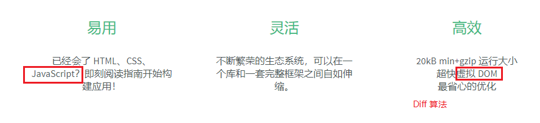

>如何学好Vue

1. 上课认真听，听懂
2. 课下多敲，**并且敲完之后多思考**
3. **放平心态，夯实每一个阶段**

## Hello World

效果：在页面上显示一个Hello World，并且内容可以动态变化

理解：jQuery之前更改内容是更改dom，现在更改是更改模型（数据），这种开发模式我们称之为`数据驱动视图`

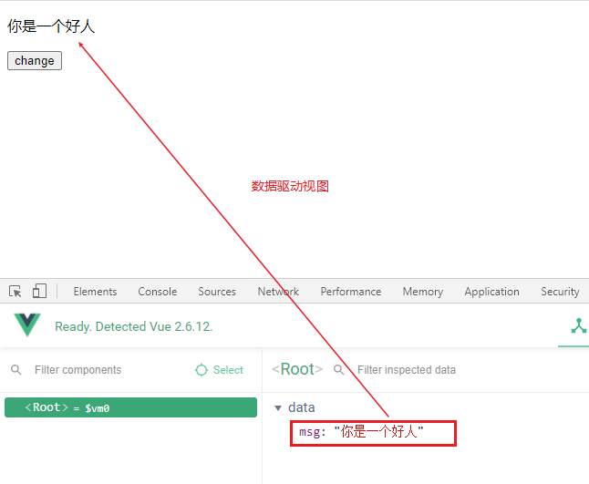

注意：

- 不是学了vue之后，之前的dom操作就不能用了，还是可以用，但是建议除非真的要操作dom，否则的话还是使用`指令`
- 如果真的需要操作dom，建议使用`ref`

MVVM：

- View 视图：展示内容
- Model 模型：负责提供数据
- View-Model 视图模型，简写成VM：起桥梁作用，负责把数据交给视图展示

## 插件

浏览器中的插件：Vue.js devtools，如果需要使用它，就必须导入开发版本的`vue.js`

## 指令

作用：**替代dom操作**

分类：https://cn.vuejs.org/v2/api/#%E6%8C%87%E4%BB%A4

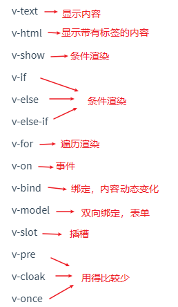

说明：除了上面的那些以`v-`，还有一个特殊的指令`{{}}`插值表达式

区别：**`{{}}`写在标签之间、`v-`是写在元素属性上面的**

> {{}}：显示内容，并且动态更改内容

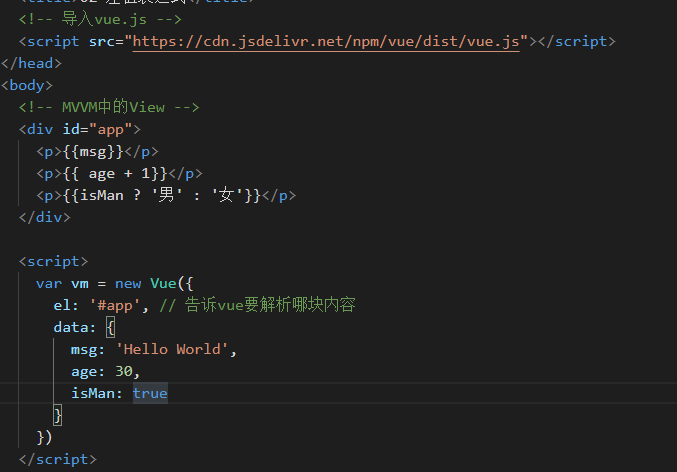

> v-text & v-html：显示内容，并且动态更改内容

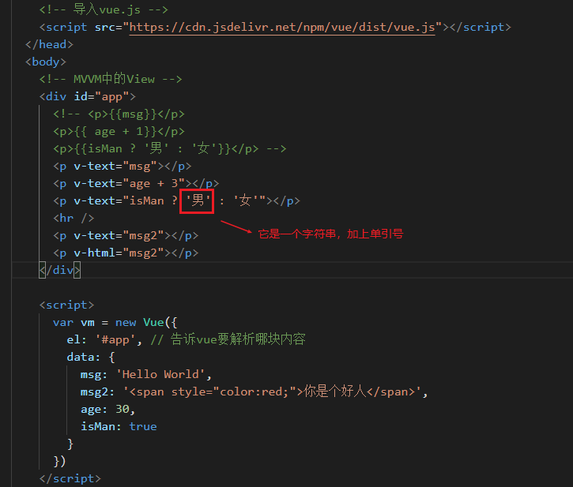

> v-on：事件，**v-on:可以简写成@**

它还支持事件修饰符，事件修饰符，可以简化我们对`冒泡`、`默认行为`的处理

语法：`@click.事件修饰符`

分类：

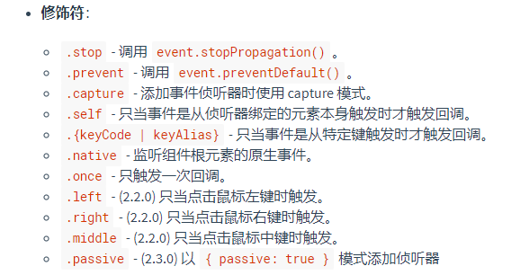

>v-bind：绑定，内容不写死

注意：`v-bind:`可以简写成`:`，一般情况下以后都是用`:`

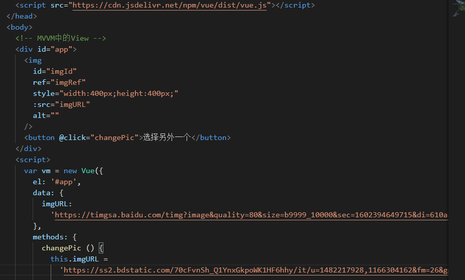

> v-model: 双向绑定，表单操作

效果：

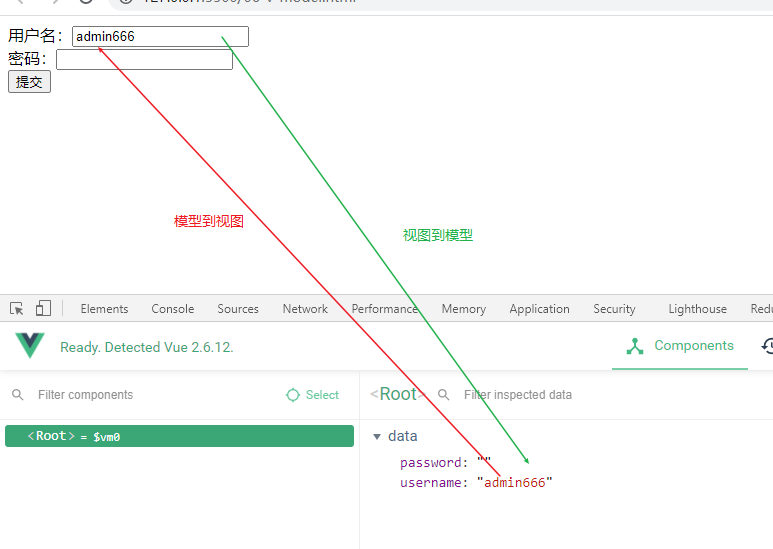

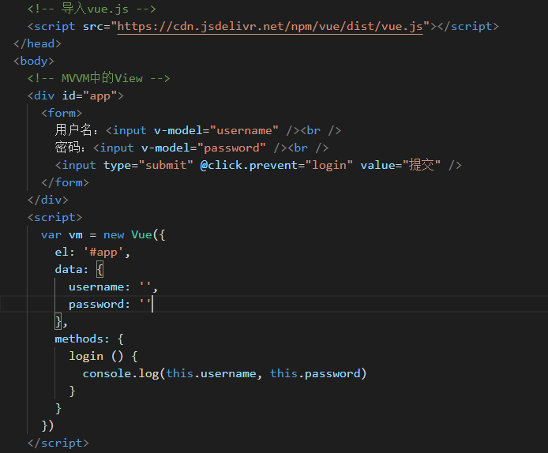

> 使用 v-bind + @input 事件来完成v-model的效果

其实`v-model`就是两条线，我们一条一条的来实现

- 模型到视图：**就是使用v-bind，绑定input的value属性**
- 视图到模型：**监听input的input事件，然后在方法中拿到事件对象，拿到对应的值，赋值给对应的模型**

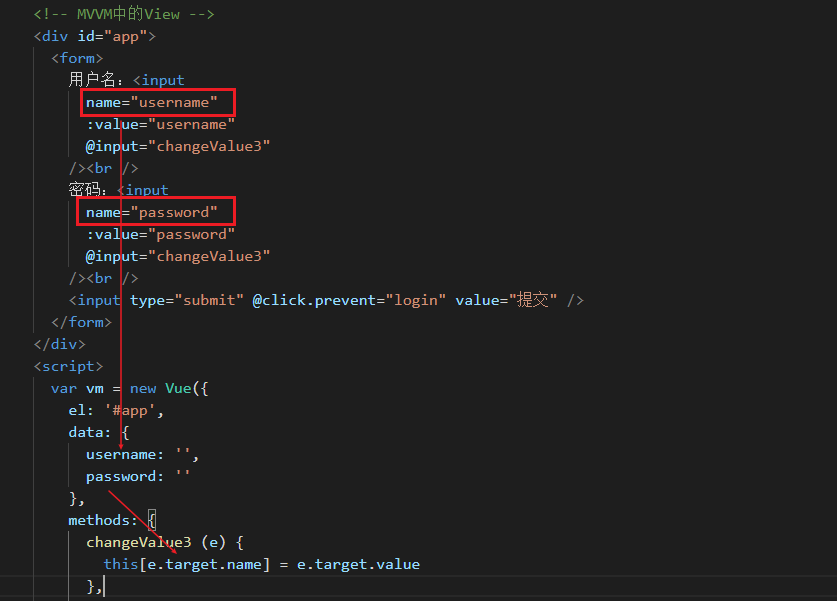

> v-if & v-show

v-if & v-show如何选择？

看使用场景，如果需要频繁切换，使用`v-show`，可以提高性能，如果需要等到条件满则的时候，才渲染，那么使用`v-if`

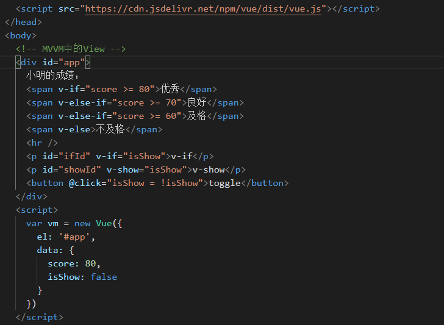

> v-for

**遍历数组**、遍历对象、遍历数值

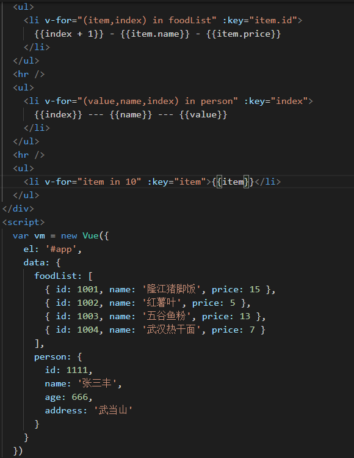

> v-pre & v-cloak & v-once 【了解】

v-pre：原样输出，不需要vue解析

v-once：只在刚开始的时候渲染一次，后面哪怕模型改了，也不渲染了

 v-cloak：解决内容显示闪烁的问题

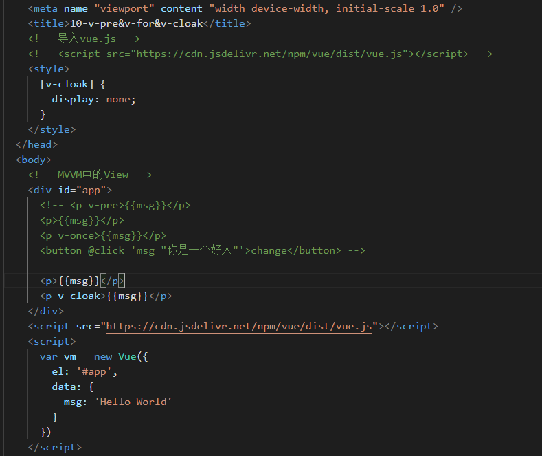

> 其它

一般情况下，vue建议使用它的指令来替代dom操作，如果万一非得操作dom，他也建议使用他提供的`ref`

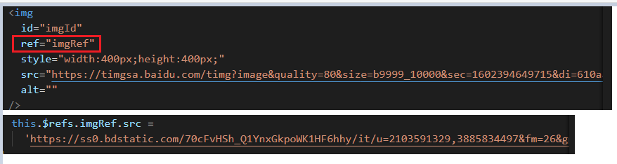

## 计算属性

它是根据其它`模型`值，计算出新的结果

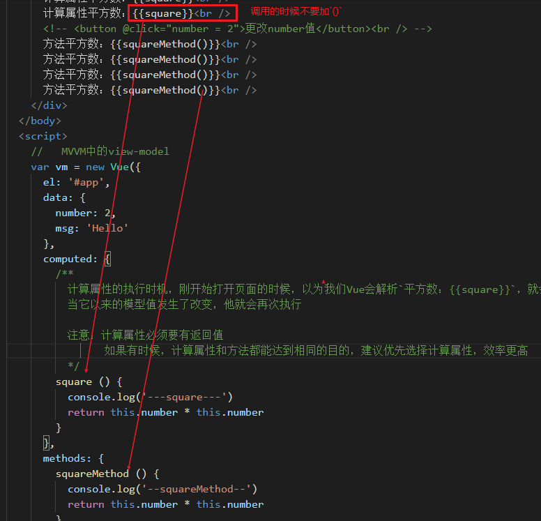