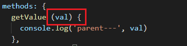

# Day04

## 反馈

知识点：

- 沙箱（闭包）和vue组件（模块）的相同点和不同点

  相同点：都有独立的作用域，都是解决全局变量名污染

  不同点：语法上，闭包有点缺陷，模块没有

  模块化的核心：导入和导出

  导入：import xxx from '路径'  / import  '路径'

  导出：export default(只导出一个成员) / export （导出多个成员）

- 父组件和子组件有点模糊

- 再讲下数组值传递和引用传递，数组引用类型那个没搞懂，可以讲讲原理吗？

其它：

- 一下吸收好多内容 脑容量撑不住了

## 内容回顾

页面 & 组件： 页面大，组件小

.vue组成的三部分：template(必须)、script、style

vue serve App.vue --open

## 组件传值(传数据)

### 父组件传值给子组件（props）

应用场景：以后使用element-ui的table组件，你得给它传值

传值方：父组件

​	写在template

​	

接收方：子组件

​	写在script

​	

### 子组件传值给父组件（通过触发自定义事件）

传值方：子组件

​	写在script里面

​	this.$emit(事件的名字, 参数)


接收方：父组件




### 兄弟组件传值（通过触发自定义事件）

注意：虽然我们兄弟组件传值，也是使用触发自定义事件，但是跟子组件传值给父组件不一样的地方在于不能使用`this`

它需要的是一个公共的Vue实例`new Vue()`

传值方：兄弟一组件

接收方：兄弟二组件

步骤：

1、整一个模块，创建一个公共的Vue实例(bus)，然后导出

2、在传值方，导入公共的bus，然后通过调用公共的bus，触发自定义事件


3、在接收方，在生命周期钩子`mounted`中，注册监听自定义事件，并且写好处理函数


## 插槽（slot）(传视图)

注意：**用于父子组件之间传值****（传视图）**

体会：**灵活**


`<slot></slot>`必须写在子组件中，它其实是起了一个占位的作用

应用场景：一般第三方UI组件中用得很多，比如ElementUI，如果我们自己要封装一个UI组件库，也离不开插槽

一般第三方UI组件库中的那些组件，其实里面就写好了`<slot></slot>`，等着我们使用他们的时候去替换他们，比如

`Dialog`

### 默认插槽

步骤：

1. 形成好父子组件关系

2. 在子组件中使用`<slot>默认内容</slot>`默认插槽占个位

3. 在父组件template中，在使用子组件的标签之间写上我们的**视图部分**

   ```vue
   <template>
   	<my-dialog>
       	想要显示的内容，写在这里
       </my-dialog>
   </template>
   ```

### 具名插槽

应用场景：一个子组件中有多个地方要被替换，这个时候，我们就使用具名插槽

步骤：

1. 形成好父子组件关系

2. 在子组件中，使用多个`<slot></slot>`写好插槽，但是一个子组件中只能有一个默认插槽

   

3. 在父组件中，根据插槽的名字来进行替换，也需要在template中的**子组件标签**之间写

   

   

### 作用域插槽（难）

作用：把显示内容的控制权，控制在父组件中

涉及到的知识点：父组件传值给子组件、

步骤：

1. 形成父子关系

2. 在父组件中给MyTable子组件，传递一个数组

   

3. 子组件接收到值之后，把能渲染的，先渲染

   

4. 子组件中，最后一列无法自己搞定，那么它就使用`<slot v-bind:xxx="yyy"></slot>`把值传递给父组件，并且等着将来被替换

   

5. 父组通过作用域插槽` <template #test="slotProps"></template>`，拿到子组件中传递的值，然后渲染好好内容，最终把子组件中`<slot></slot>`占位的地方替换到

   

疑惑点：

1. 为什么现在自己写子组件，后面我们就不会再写子组件了，因为Element已经写好了，它内部就是通过`<slot v-bind:xxx="yyy"></slot>`传给父组件
2. 我们以后主要是在父组件中，通过作用域插槽` <template #test="slotProps"></template>`，拿嗯么到子组件传递过来的值，然后自己决定渲染成什么样子（**父组件掌握控制权**）

## 路由

### 概念

它是用来实现单页面应用(SPA Single Page Application)，与之对应的是多页应用（京东、淘宝）

单页面应用的典型例子：网易云音乐

多页面应用的典型例子：京东

### 使用脚手架生成项目

前提：安装全局包 `npm i @vue/cli -g`

生成步骤：

1. 把终端切换到桌面

2. 在终端中输入`vue create router_test`

3. 进行选择

   

   

   

   

   

   

   

4. 把**项目切换到生成项目的根目录下**，运行`npm run serve`

   

   5. 如果希望运行`npm run serve`的时候，自动打开浏览器，在项目根目录下的package.json中的scripts/serve 的值后面

      接一个--open

      

      6. 当项目生成完之后，运行也没有问题了，那么就在终端中输入`npm i vue-router`【注意：在项目根目录】

### 基本使用

