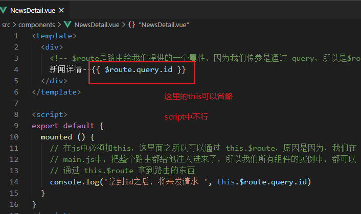

## 内容回顾

组件间传值：

- 父组件传值给子组件（props）
- 子组件传值给父组件（触发自定义事件）
- 兄弟组件传值（使用公共的bus，触发自定义事件）

插槽：只作用于父子组件之间

- 默认插槽
- 具名插槽
- 作用域插槽：把控制显示的权利掌握在父组件中

路由：实现单页面应用

生成项目：按照我截图去走

## 路由

### 基本使用

效果：点击两个链接的时候，分别显示对应的内容，并且浏览器不刷新，也不打开新的页面

实现步骤1：(按照之前的知识点想的步骤)

1. 创建两个组件(NewsList.vue、FoodList.vue)，并且写好内容
2. 在父组件(App.vue)中导入两个子组件(NewsList.vue、FoodList.vue)，并且注册，使用
3. 在父组件(App.vue)中设置两个a标签，给他们添加点击事件
4. 当点击新闻列表的时候，通过条件渲染显示新闻列表
5. 当点击食品列表的时候，通过条件渲染显示食品列表

实现步骤1：(使用vue-router实现)

1. 创建两个组件(NewsList.vue、FoodList.vue)，并且写好内容

2. 在`App.vue`中，使用`<router-link to="/newslist"></router-link>`

3. 安装路由包`npm i vue-router`

4. 在src目录下创建一个`router`文件夹，里面再创建一个`index.js`的文件，然后写好路由的代码

   ```js
   /**
    * 路由相关的代码就写在这里
    */
   // 导包
   import Vue from 'vue'
   import VueRouter from 'vue-router'
   
   // 在项目中使用路由
   Vue.use(VueRouter)
   
   // 创建路由对象，并且导出
   const router = new VueRouter({
     // 配置路由规则
     routes: []
   })
   
   // 导出
   export default router
   ```

5. 在`main.js`中导入创建好的路由对象，并且注入到根实例中，这样我们整个项目就有了路由功能

   ```js
   // 导入路由
   import router from './router'
   
   new Vue({
     render: h => h(App), //h其实是形参
     router // 把路由注入到根实例中、让我们应用拥有路由的功能
   }).$mount('#app')
   ```

6. 在`src/router/index.js`中在创建路由对象的时候，设置好里面的路由规则`routes`

   ```js
   // 创建路由对象，并且导出
   const router = new VueRouter({
     // routes: 配置路由规则,这个`routes`很多人容易写错
     routes: [
       /**
        * path：匹配的路径
        * component: 匹配到的组件,这个单词不要写错
        */
       { path: '/newslist', component: NewsList },
       { path: '/foodlist', component: FoodList }
     ]
   })
   ```

7. 我们得在`App.vue`中某个位置，写上路由出口`<router-view></router-view>`，然后路由匹配到的组件将渲染在这里

   ```vue
   <template>
     <div>
       <p>
         <!-- 1.0 设置点击链接 -->
         <!-- router-link最终会渲染成a标签，to代表跳转到地址，必须设置，最终会渲染成href，否则报错 -->
   
         <!-- 当我们配置完我们路由代码之后，这个组件就自动起作用了，原因是因为，我们写完路由代码之后
         这个router-link组件会进行全局注册 -->
         <router-link to="/newslist">新闻列表</router-link>&nbsp;
         <router-link to="/foodlist">食品列表</router-link>
       </p>
       <!-- 路由出口 -->
       <!-- 路由匹配到的组件将渲染在这里 -->
       <router-view></router-view>
     </div>
   </template>
   ```

### 路由模式

> hash模式

页面的url上面会有一个`#`，这个叫做hash，这个也是路由的默认模式，hash无需后台配置

> history模式

页面的url上面没有`#`，它底层实现是基于h5之后history的一个新API，`history.pushState`，但是如果我们使用history模式的话，我们的后台得配合我们

设置：在`src/router/index.js`中进行设置

```js
// 创建路由对象，并且导出
const router = new VueRouter({
  mode: 'history', // 默认是hash，如果你要更改，那么就在mode属性中更改
  // 5. routes: 配置路由规则,这个`routes`很多人容易写错
  routes: [
    /**
     * path：匹配的路径
     * component: 匹配到的组件,这个单词不要写错
     */
    { path: '/newslist', component: NewsList },
    { path: '/foodlist', component: FoodList }
  ]
})
```

### 命名路由、重定向、404


### 路由传参

> query

语法：比如：/playlist?id=5089855855

实现步骤：

1. 先创建一个`NewsDetail.vue`

2. 在`NewsList.vue`中使用`<router-link></router-link>`设置跳转链接

   ```vue
   <template>
     <div>
       <ul>
         <li>
           <router-link to="/newsdetail?id=1001">上海名媛拼多多</router-link>
         </li>
         <li>
           <router-link to="/newsdetail?id=1002">新冠疫苗上市了</router-link>
         </li>
         <li>
           <router-link to="/newsdetail?id=1003">深圳成立40周年</router-link>
         </li>
       </ul>
     </div>
   </template>
   ```

3. 在`src/router/index.js`中设置路由规则

   ```js
   // query传参，路由规则设置
   { path: '/newsdetail', component: NewsDetail }
   ```

4. 在跳转过来的组件中，拿到id

   

> params

语法：比如：/mv/10929636

步骤：

1. 新建一个`FoodDetail.vue`

2. 在`FoodList.vue`中通过`router-link`，设置可以点击的链接

   ```vue
   <template>
     <div>
       <ul>
         <li>
           <router-link to="/fooddetail/2001">法国鹅肝</router-link>
         </li>
         <li>
           <router-link to="/fooddetail/2002">澳洲鱼子酱</router-link>
         </li>
         <li>
           <router-link to="/fooddetail/2003">澳洲波龙</router-link>
         </li>
       </ul>
     </div>
   </template>
   ```

3. 在`src/router/index.js`中配置路由规则**(不一样)**

  
   

4. 在新的组件中，获取参数

   


### 嵌套路由 & 编程式导航

嵌套路由：应用场景，后台管理

`$route`、`$router`

$route：获取参数(query,params)、监听路由变化

`$router`：编程式导航  `this.$router.push('/layout')`，就是通过js代码跳转

实现步骤：（主要写Layout中的代码实现）

1. 把左边、右边UI写好

2. 创建两个组件`Menu1.vue`、`Menu2.vue`【它只是展示在Layout.vue的右边】

3. 在Layout.vue左边，使用`<router-link to="xxx"></router-link>`设置好跳转链接

4. 在`src/router/index.js`我们要配置嵌套路由规则了，**这个和之前还略有不同**

   

5. 在`Layout.vue`的右边，设置下路由出口

   

## axios

### 作用：

用于发送ajax请求

文档地址：https://github.com/Duanzihuang/vuebase/blob/main/day05/2-%E5%85%B6%E5%AE%83%E8%B5%84%E6%96%99/server_api/API.md

方法名的含义：GET：获取、POST：新增、PUT：修改、DELETE：删除

### 注意：

- **`GET`和`DELETE`都是是通过url传参，建议写在第二个参数上，通过`params: {aaa:bbb,yyy:zzz}`传参**
- **`POST`和`PUT`都是通过请求体传参，也是写在第二个参数上，但是不需要设置`params`属性，直接写`{aaa:bbb,yyy:zzz}`即可，这个要和`GET`、`DELETE`区别一下**
- **如果需要设置请求头，一定要注意，如果是`GET`和`DELETE`请求，则是要写在第二个参数上，和`params`同级，例如`axios.get(url, {params:{aaa:bbb,yyy:zzz},{headers: {token:'Dadsafd111'}})`如果是`POST`和`PUT`则写在第三个参数上，例如`axios.post(url, data,{headers: {token:'Dadsfsa222'}})`，强烈建议如果多个地方都需要设置请求头，则统一在请求拦截器中进行处理**

### 基本使用

1. 导入axios
2. axios.get、axios.post、axios.put、axios.delete

### 其它配置

基准路径：axios.defaults.baseURL = 'http://huangjiangjun.top:3006/api/'

### 拦截器

建议：不要手写，容易单词写错，copy过来之后再改

```js
// 设置请求拦截器
axios.interceptors.request.use(
  function (config) {
    // 在发送请求之前做些什么
    // console.log(config)
    config.headers.token = 'asfasfasdaf'
    return config
  },
  function (error) {
    // 对请求错误做些什么
    return Promise.reject(error)
  }
)

// 添加响应拦截器
axios.interceptors.response.use(
  function (response) {
    // 对响应数据做点什么
    // console.log(response)
    // 只把服务器返回的数据返回给 axios.get/post/put/delete的方法中的then
    return response.data
  },
  function (error) {
    // 对响应错误做点什么
    return Promise.reject(error)
  }
)
```

## async(异步函数)

### 回顾Promise


## 其它

Vue中哪些地方建议大写，哪些地方需要小写

大写：组件的命名，及导入它时候的名字

小写：组件的 template 中、路由规则中的 path 也是小写

### 作业

在桌面生成一个叫做`hymusic`的项目

生成项目之后再安装如下包：

npm i vue-router axios element-ui moment

**安装之后，把终端切换到项目根目录，然后运行**`npm run serve`