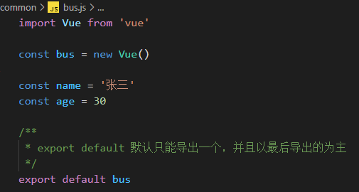
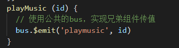
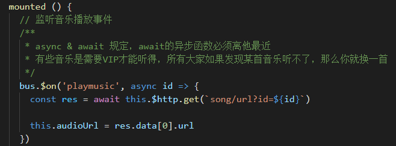
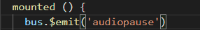
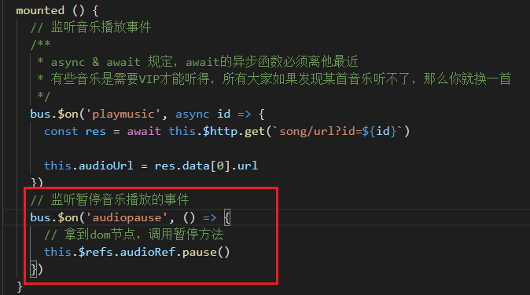

#    Day07

## 回顾

## 歌单详情

步骤：

1. 创建一个`Playlist.vue`，并且写好基本内容

2. 在`src/router/index.js`中配置路由规则

   ```js
   // query 方式传参
   { path: '/playlist', component: Playlist }
   ```

3. 在`发现音乐`、`歌单列表`中，通过编程式导航跳转(`this.$router.push`)

   ```vue
   <script>
   	export default {
           ...
           methods: {
               // 跳转到歌单详情
               toPlaylist(id) {
                 this.$router.push(`/playlist?id=${id}`)
               }
           }
       }
   </script>
   ```

4. 拿到歌单id、发送请求

   ```vue
   <script>
   export default {
     name: 'Playlist',
     data () {
       return {
         playlist: {} // 初次渲染
       }
     },
     // Vue底层会自动执行这个生命周期钩子，只会执行一次
     // https://cn.vuejs.org/v2/guide/instance.html
     mounted () {
       this.getPlaylistData()
     },
     methods: {
       async getPlaylistData () {
         const res = await this.$http.get(
           `playlist/detail?id=${this.$route.query.id}`
         )
   
         // 再次渲染
         this.playlist = res.playlist
       }
     }
   }
   </script>
   ```

5. 渲染(时长、时间的过滤器)，这是全局的，所以写在`main.js`

   ```js
   // 格式化播放次数
   Vue.filter('formatCount', val => {
     if (val / 10000 > 10) {
       return parseInt(val / 10000) + '万'
     } else {
       return val
     }
   })
   // 格式化时间
   import moment from 'moment'
   Vue.filter('formatTime', (val, formatStr = 'YYYY-MM-DD HH:mm:ss') => {
     return moment(val).format(formatStr)
   })
   // 格式化分秒
   Vue.filter('formatSecond', val => {
     // 处理分
     let min = Math.ceil(val / 1000 / 60)
     min = min < 10 ? '0' + min : min
   
     // 处理秒
     let second = Math.ceil((val / 1000) % 60)
     second = second < 10 ? '0' + second : second
   
     return min + ':' + second
   })
   ```

   

##最新音乐

发请求、渲染

```vue
<template>
  <div class="songs-container">
    <!-- 分类 -->
    <div class="tab-bar">
      <span
        v-for="item in typies"
        :key="item.type"
        :class="['item', item.type === type ? 'active' : '']"
        @click="type = item.type"
        >{{ item.name }}</span
      >
    </div>
    <!-- 底下内容区域 -->
    <table class="el-table playlit-table">
      <thead>
        <tr>
          <th></th>
          <th></th>
          <th>音乐标题</th>
          <th>歌手</th>
          <th>专辑</th>
          <th>时长</th>
        </tr>
      </thead>
      <tbody>
        <tr
          class="el-table__row"
          v-for="(item, index) in songList"
          :key="item.id"
        >
          <td>{{ index + 1 }}</td>
          <td>
            <div class="img-wrap">
              <span
                class="iconfont icon-play"
              ></span>
            </div>
          </td>
          <td>
            <div class="song-wrap">
              <div class="name-wrap">
                <span>{{ item.name }}</span
                ><span v-if="item.mvid" class="iconfont icon-mv"></span>
              </div>
              <span></span>
            </div>
          </td>
          <td>{{ item.artists[0].name }}</td>
          <td>{{ item.album.name }}</td>
          <td>{{ item.duration | formatSecond }}</td>
        </tr>
      </tbody>
    </table>
  </div>
</template>

<script>
export default {
  name: 'Songs',
  data () {
    return {
      type: 0, // 0：全部   7：华语  96：欧美  8：日本  16：韩语
      typies: [
        { type: 0, name: '全部' },
        { type: 7, name: '华语' },
        { type: 96, name: '欧美' },
        { type: 8, name: '日本' },
        { type: 16, name: '韩语' }
      ],
      songList: [] // 最新音乐列表
    }
  },
  mounted () {
    this.getSongListData()
  },
  watch: {
    type () {
      this.getSongListData()
    }
  },
  methods: {
    async getSongListData () {
      const res = await this.$http.get('top/song', {
        params: {
          type: this.type
        }
      })

      this.songList = res.data
    }
  }
}
</script>

<style lang="less">
.songs-container {
  .tab-bar {
    display: flex;
    justify-content: flex-end;
    .item {
      font-size: 15px;
      color: gray;
      margin-right: 20px;
      cursor: pointer;
      &.active {
        color: #dd6d60;
      }
    }
  }
  .song-table {
    .song-wrap {
      > span {
        margin-top: 20px;
        display: inline-block;
        color: #bebebe;
      }
      .icon-mv {
        padding-left: 5px;
        color: #dd6d60;
      }
    }
    .img-wrap {
      position: relative;
      width: 70px;
      height: 70px;
      img {
        width: 70px;
        height: 70px;
        border-radius: 5px;
      }
      .icon-play {
        position: absolute;
        top: 50%;
        left: 50%;
        transform: translate(-50%, -50%);
        width: 25px;
        height: 25px;
        color: #dd6d60;
        font-size: 12px;
        border-radius: 50%;
        display: flex;
        align-items: center;
        justify-content: center;
        background: rgba(255, 255, 255, 0.8);
        &::before {
          transform: translateX(1px);
        }
      }
    }
  }
}
</style>
```

## 最新MV

发请求，获取数据，然后渲染，注意：**有3个地方，需要watch**

```vue
<template>
  <div class="mvs-container">
    <!-- 筛选条件 -->
    <div class="filter-wrap">
      <div class="seciton-wrap">
        <span class="section-type">地区:</span>
        <ul class="tabs-wrap">
          <li
            class="tab"
            v-for="item in areas"
            :key="item"
            @click="area = item"
          >
            <span :class="['title', item === area ? 'active' : '']">{{
              item
            }}</span>
          </li>
        </ul>
      </div>
      <div class="type-wrap">
        <span class="type-type">类型:</span>
        <ul class="tabs-wrap">
          <li
            class="tab"
            v-for="item in types"
            :key="item"
            @click="type = item"
          >
            <span :class="['title', item === type ? 'active' : '']">{{
              item
            }}</span>
          </li>
        </ul>
      </div>
      <div class="order-wrap">
        <span class="order-type">排序:</span>
        <ul class="tabs-wrap">
          <li
            class="tab"
            v-for="item in orders"
            :key="item"
            @click="order = item"
          >
            <span :class="['title', item === order ? 'active' : '']">{{
              item
            }}</span>
          </li>
        </ul>
      </div>
    </div>
    <!-- 内容 -->
    <div class="mvs">
      <div class="items">
        <div class="item" v-for="item in mvList" :key="item.id">
          <a href="#/mv/10756067" class=""
            ><div class="img-wrap">
              
              <div class="num-wrap">
                <div class="iconfont icon-play"></div>
                <div class="num">{{ item.playCount | formatCount }}</div>
              </div>
            </div>
            <div class="info-wrap">
              <div class="name">{{ item.name }}</div>
            </div></a
          >
        </div>
      </div>
    </div>
  </div>
</template>

<script>
export default {
  data () {
    return {
      area: '全部',
      areas: ['全部', '内地', '港台', '欧美', '日本', '韩国'],
      type: '全部',
      types: ['全部', '官方版', '原声', '现场版', '网易出品'],
      order: '上升最快',
      orders: ['上升最快', '最热', '最新'],
      mvList: []
    }
  },
  mounted () {
    this.getMvsListData()
  },
  watch: {
    area () {
      this.getMvsListData()
    },
    type () {
      this.getMvsListData()
    },
    order () {
      this.getMvsListData()
    }
  },
  methods: {
    async getMvsListData () {
      const res = await this.$http.get('mv/all', {
        params: {
          offset: 0,
          limit: 12,
          area: this.area,
          type: this.type,
          order: this.order
        }
      })

      this.mvList = res.data
    }
  }
}
</script>

<style lang="less">
.mvs-container {
  padding-top: 20px;
  .filter-wrap {
    > div {
      margin-bottom: 30px;
      vertical-align: baseline;
      display: flex;
      align-items: center;
      span {
        font-size: 14px;
        height: 100%;
        &.title {
          margin: 20px;
          color: gray;
          cursor: pointer;
          padding: 5px 20px;
          &.active {
            color: #dd6d60;
            background-color: #fcf6f5;
            border-radius: 20px;
          }
          &::before {
            content: '', pos;
          }
        }
      }
      ul {
        display: flex;
        li:not(:last-child) {
          border-right: 1px solid #f2f2f1;
        }
      }
    }
  }
  .mvs {
    .items {
      display: flex;
      justify-content: flex-start;
      flex-wrap: wrap;
      .item {
        width: 250px;
        cursor: pointer;
        margin-right: 25px;
        margin-bottom: 30px;
        .img-wrap {
          width: 100%;
          position: relative;
          img {
            width: 100%;
            border-radius: 5px;
          }
          .num-wrap {
            position: absolute;
            color: white;
            top: 0;
            right: 0;
            display: flex;
            align-content: center;
            font-size: 15px;
            padding-right: 5px;
            padding-top: 2px;
            .icon-play {
              font-size: 12px;
              display: flex;
              align-items: center;
              margin-right: 5px;
            }
          }
        }
        .info-wrap {
          .name {
            font-size: 15px;
          }
          .singer {
            font-size: 14px;
            color: #c5c5c5;
          }
        }
      }
    }
  }
}
</style>
```

## MV详情

步骤：

1. 在MV列表中，通过声明式导航跳转到MV详情页面

2. 创建`Mv.vue`页面，并且在`src/router/index.js`中配置好路由规则

   ```js
   // params 方式传参
   { path: '/mv/:id', component: Mv }
   ```

3. 发送请求，发送四个

   ```vue
   <script>
   export default {
     name: 'Mv',
     data () {
       return {
         // mv地址
         mvUrl: '',
         // mv的名字
         mvName: '',
         // 播放次数
         playCount: '',
         // 发布时间
         publishTime: '',
         // 描述
         desc: '',
         // 歌手名
         artistName: '',
         // 封面
         artistCover: '',
         // 相关推荐MV
         simiMVList: []
       }
     },
     mounted () {
       // 获取播放地址
       this.getMvUrlData()
       // 获取MV详情
       this.getMvDetailData()
       // 获取相关mv列表
       this.getSimiMvListData()
     },
     methods: {
       async getMvUrlData () {
         const res = await this.$http.get(`mv/url?id=${this.$route.params.id}`)
   
         this.mvUrl = res.data.url
       },
       async getMvDetailData () {
         const res = await this.$http.get(
           `mv/detail?mvid=${this.$route.params.id}`
         )
   
         this.mvName = res.data.name
         this.playCount = res.data.playCount
         this.publishTime = res.data.publishTime
         this.desc = res.data.desc
   
         // 获取艺术家信息
         const res2 = await this.$http.get(`artists?id=${res.data.artistId}`)
         this.artistName = res2.artist.name
         this.artistCover = res2.artist.picUrl
       },
       async getSimiMvListData () {
         const res = await this.$http.get(`simi/mv?mvid=${this.$route.params.id}`)
   
         this.simiMVList = res.mvs
       }
     }
   }
   </script>
   ```

4. 渲染

   ```vue
   <template>
     <div class="mv-container">
       <div class="mv-wrap">
         <h3 class="title">mv详情</h3>
         <div class="video-wrap">
           <video controls="controls" :src="mvUrl" autoplay></video>
         </div>
         <div class="info-wrap">
           <div class="singer-info">
             <div class="avatar-wrap">
               
             </div>
             <span class="name">
               {{ artistName }}
             </span>
           </div>
           <div class="mv-info">
             <h2 class="title">{{ mvName }}</h2>
             <span class="date">发布：{{ publishTime }}</span
             ><span class="number">播放：{{ playCount | formatCount }}次</span>
             <p class="desc">{{ desc }}</p>
           </div>
         </div>
       </div>
       <div class="mv-recommend">
         <h3 class="title">相关推荐</h3>
         <div class="mvs">
           <div class="items" v-for="item in simiMVList" :key="item.id">
             <div class="item">
               <div class="img-wrap">
                 <span
                   class="iconfont icon-play"
                 ></span>
                 <div class="num-wrap">
                   <div class="iconfont icon-play"></div>
                   <div class="num">{{ item.playCount | formatCount }}</div>
                 </div>
                 <span class="time">{{ item.duration | formatSecond }}</span>
               </div>
               <div class="info-wrap">
                 <div class="name">{{ item.name }}</div>
                 <div class="singer">{{ item.artistName }}</div>
               </div>
             </div>
           </div>
         </div>
       </div>
     </div>
   </template>
   ```

点击右侧，切换内容显示：

1. 给右边添加点击事件

2. 我们通过编程式导航，跳转到mv页面

3. 使用watch监听`$route`、`$route.params`、`$route.params.id`都可以监听路径的改变

   ```vue
   <script>
   	export default {
           watch: {
           // $route () {
           //   // 获取播放地址
           //   this.getMvUrlData()
           //   // 获取MV详情
           //   this.getMvDetailData()
           //   // 获取相关mv列表
           //   this.getSimiMvListData()
           // }
           // '$route.params' () {
           //   // 获取播放地址
           //   this.getMvUrlData()
           //   // 获取MV详情
           //   this.getMvDetailData()
           //   // 获取相关mv列表
           //   this.getSimiMvListData()
           // }
           '$route.params.id' () {
             // 获取播放地址
             this.getMvUrlData()
             // 获取MV详情
             this.getMvDetailData()
             // 获取相关mv列表
             this.getSimiMvListData()
           }
         }
       }
   </script>
   ```

## 音频播放

当点击`发现音乐`、`歌单详情`、`最新音乐`中的播放按钮的时候，实现音乐播放

1. 创建一个公共bus

   

2. 在传值方，使用公共bus触发自定义的播放事件，并且传值

   

3. 在接收方，使用公共bus监听播放事件，并且发请求，获取音频的url

   

个除了正常播放音频之外，我们来到MV页面的时候，需要暂停音频播放

1. 来到MV页面的时候，我在mounted钩子中，就直接调用bus，触发一个audiopause事件

   

2. 在MyAudio组件中，监听播放暂停的方法，实现音乐暂停

   